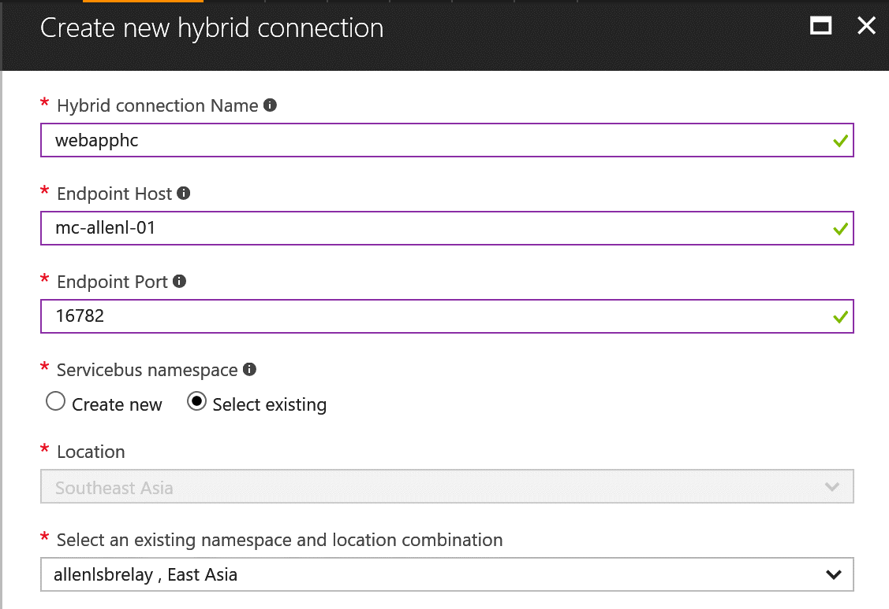
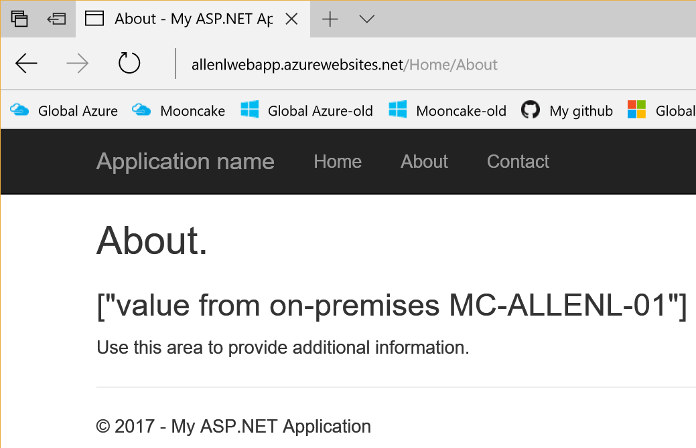
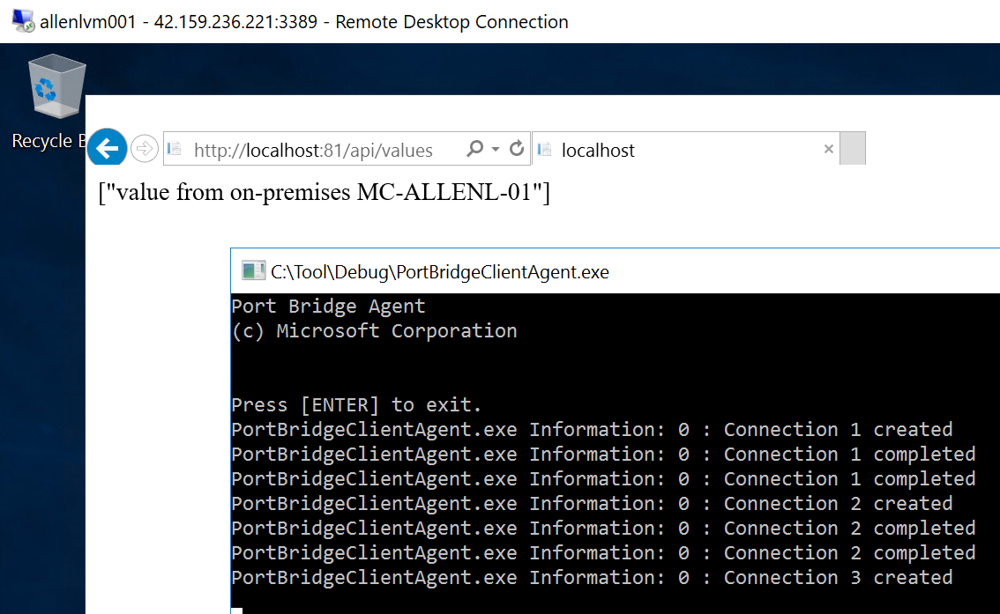

# 构建混合应用方式之 - 混合连接

[前文](aog-service-bus-relay-connect-on-primeses-apps-to-outside-world-via-wcf-relay.md)介绍了通过 WCF 中继构建混合应用的方式，由于对 WCF 的依赖，使得其使用有一定的局限性，基本上只适用于本地服务是 WCF 的 .NET 应用。而混合连接则弥补了这一块的缺陷，除了支持原有 WCF 中继的功能之外，还提供了多平台多语言的支持，这只要是因为混合连接是基于开放标准协议 web sockets 实现的。

以下是与 WCF 中继的一个对比表：

<table align="center">
<tr>
    <th></th>
    <th>WCF 中继</th>
    <th>混合连接</th>
</tr>
    <td>建立本地和云的安全连接</td>
    <td align="center"></td>
    <td align="center"></td>
<tr>
    <td>无需修改防火墙添加入站端口</td>
    <td align="center"></td>
    <td align="center"></td>
</tr>
<tr>
    <td>无需对网络配置做重大修改</td>
    <td align="center"></td>
    <td align="center"></td>
</tr>
<tr>
    <td>基于开放标准协议</td>
    <td align="left">（只支持WCF）</td>
    <td align="center"></td>
</tr>
<tr>
    <td>跨平台支持</td>
    <td align="left">（只支持Windows）</td>
    <td align="center"></td>
</tr>
<tr>
    <td>多语言支持</td>
    <td align="left">（只支持.NET）</td>
    <td align="center"></td>
</tr>
</table>

下面主要分三种情况来介绍混合连接的使用：

1. 基于混合连接 SDK
2. 基于 Azure Web 应用混合连接工具
3. 基于 PortBridge 示例程序

## 创建混合连接

可以登陆 [Azure中国门户网站](https://portal.azure.cn/)，按照界面提示一步步创建。也可以通过 PowerShell 命令，如下。

```PowerShell
# login to Azure China with your account
Login-AzureRmAccount -Environment AzureChinaCloud

$rgName = "relaydemorg"
$namespaceName = "relaydemons"
$location = "China East"
$hcName = "hcdemo"

New-AzureRmResourceGroup -Name $rgName -Location $location
New-AzureRmRelayNamespace -ResourceGroupName $rgName -Name $namespaceName -Location $location
New-AzureRmRelayHybridConnection -Namespace $namespaceName -ResourceGroupName $rgName -Name $hcName -RequiresClientAuthorization $true
```

创建出来混合连接字符串就是`sb://relaydemons.servicebus.chinacloudapi.cn/hcdemo`。

## 基于混合连接 SDK

目前微软官方提供了两个 SDK，一个是 .NET 语言版本，另一个是 Node.JS 版本。两个 SDK 也都开源在 Github 上：[azure-relay-net](https://github.com/Azure/azure-relay-dotnet)，[azure-relay-node](https://github.com/Azure/azure-relay-node)。

### 本地服务（监听者）

首先本地服务端作为监听者，需要要使用具有监听权限的连接字符串，创建一个出站的 WebSocket 连接，也就是注册到 Azure 中继服务上。如果本地有多个监听者，那么进入的访问请求会随机地发送。一个混合连接最多支持25个监听者。

```
private const string ConnectionString = "connection string with listen permission";
// Listen
var listener = new HybridConnectionListener(ConnectionString);
await listener.OpenAsync();
// Accept
HybridConnectionStream relayConnection = await listener.AcceptConnectionAsync();
// Read
var reader = new StreamReader(relayConnection);
var line = await reader.ReadLineAsync();
// Output
Console.WriteLine(line); 
// Close
await relayConnection.CloseAsync(CancellationToken.None);
```

### 外部服务（发送者）

发送者提供具有发送权限的连接字符串（不是必须如果建立混合连接时没有要求客户端认证，不过从安全角度考虑，推荐要求认证），与混合连接服务建立 WebSocket 连接，最终会与一个监听者建立起连接，从而进行沟通。

```
private const string ConnectionString = "connection string with send permission";
// Connect
var client = new HybridConnectionClient(ConnectionString);
HybridConnectionStream relayConnection = await client.CreateConnectionAsync();
// Write
var writer = new StreamWriter(relayConnection) { AutoFlush = true };
await writer.WriteLineAsync("hello from outside");
// Close
await relayConnection.CloseAsync(CancellationToken.None);
```

当然，因为搭建的 WebSocket 是双向通道，所以本地服务端也可以发送消息到外部服务端的。

## 连接字符串

前面提到需要用到不同权限的连接字符串，总共有三种权限 : 管理，发送和监听，可以根据需要创建不同权限搭配的安全访问策略，然后在它的具体界面里会自动生成相应的连接字符串，直接复制使用即可，如下图。


如果本地服务不能或者不希望被修改成调用 SDK，比如云端 Web 应用调用本地的 Web Api 或者 SQL 数据库，那该如何使用混合连接呢？ Azure Web 应用已经整合了混合连接，可以很方便的配置，而不需要对本地服务做任何修改。

完整代码示例参见[此处](https://github.com/wacn/AOG-CodeSample/tree/master/ServiceBus/CSharp/RelaySimpleSample)。

## 基于 Azure Web 应用混合连接工具

目前 Azure 中国还没有支持混合连接的整合，不过已经在路上了，应该会很快就可上线。以下用 Azure 全球来演示，最终 Azure 中国也会是同样的体验。

### 配置混合连接端节点

登陆 Azure 门户网站，找到你的 Web 应用，在设置下面点击网络，在展开的页面中点击 “**配置你的混合连接端节点**”，打开页面如下：


点击“**下载连接管理工具**”下载，后面会用到。

点击“**添加混合连接**”，在打开的页面里面点击添加，如下图。填入相应信息，其中名称可以自定义，而端节点主机必须是运行你本地服务的机器名称，端节点端口也是本地服务所在端口。命名空间选择前面已经创建好的，也可以这里创建新的。



创建完成后，把前面下载的连接管理工具安装在运行本地服务的机器上。然后打开混合连接管理工具，点击 “**Configure another Hybrid Connection**”，这个时候会弹出登陆框，输入你的 Azure 订阅账户登陆后，会显示当前订阅中已有的混合连接，如下图。


选择配置了正确端节点的混合连接，然后点击 “**Save**” 保存。这个混合连接就会将本地与云端 Web 应用建立起连接，状态显示为 “**Connected**”。


这样，在 Web 应用里面就可以通过“**端节点名称：端口**”的方式来访问本地的服务了。比如我这里演示的，我在本地运行了一个 Web API 服务（api/values）在 16782 端口，返回字符串 “**value from on-premises <本地机器名称>**”，然后通过混合连接，云端 Web 应用就可以很简单的访问本地服务了，代码如下：

```
using (var httpClient = new HttpClient())
{
    var onPremSvcUri = "http://mc-allenl-01:16782/api/values";
    using (var response2 = httpClient.GetAsync(onPremSvcUri).Result)
    {
        if (response2.IsSuccessStatusCode)
        {
            ViewBag.Message = $"{response2.Content.ReadAsStringAsync().Result}";
        }
    }
}
```

结果如下：



对于其他本地服务，比如 SQL 服务，也可以用同样的方式连接。

## 基于 PortBridge 示例程序

如果外部服务不是用 Azure Web 应用，又该如何使用混合连接呢？

可以通过混合连接来实现端口转发，从而建立连接通道。微软官方示例 [PortBridge](https://github.com/Azure/azure-relay/tree/master/samples/Hybrid%20Connections/DotNet/portbridge) 正是演示了这种功能。接下来，我们用它来演示在云端虚拟机中的 Web 应用调用本地 Web API。


创建以本地服务所运行的机器为名称的混合连接（演示名称 mc-allenl-01），如何创建请参照文章最开始的 PowerShell 命令。并分别创建发送和监听权限的共享访问策略。


将 PortBridge 下载并编译，修改 PortBridgeServerAgent.exe.config 文件中 portBridge 相关配置，其中 targetHost 配置成本地服务所运行的机器名称，端口则为本地服务所在端口，本示例配置如下。然后将整个文件夹复制到本地服务所运行的机器上，并双击 PortBridgeServerAgent.exe 运行。

```
<portBridge serviceBusNamespace="allenlrelaydemo.servicebus.chinacloudapi.cn" serviceBusAccessRuleName="listen" serviceBusAccessRuleKey="******">
  <hostMappings>
    <add targetHost="mc-allenl-01" allowedPorts="16785"/>
  </hostMappings>
</portBridge>
```
修改 PortBridgeClientAgent.exe.config 文件中 portBridgeAgent 的相关配置，其中 targetHost 设置成本地服务所运行的机器名称，localTcpPort 设为你期望使用访问的端口，remoteTcpPort 则为本地服务所运行的端口，本示例配置如下。将整个文件夹复制到 Azure 虚拟机中，并双击 PortBridgeClientAgent.exe 运行。

```
<portBridgeAgent serviceBusNamespace="allenlrelaydemo.servicebus.chinacloudapi.cn" serviceBusAccessRuleName="send" serviceBusAccessRuleKey="******">
  <portMappings>
    <port localTcpPort="81" targetHost="mc-allenl-01" remoteTcpPort="16782">
      <firewallRules>
        <rule source="127.0.0.1"/>
        <rule sourceRangeBegin="10.0.0.0" sourceRangeEnd="10.255.255.255"/>
      </firewallRules>
    </port>
  </portMappings>
</portBridgeAgent>
```

在 Azure 虚拟机中访问 http://localhost:81/api/values，没有运行 PortBridge 之前是会失败的，但开启 PortBridge ，也就是通过混合连接建立通道之后，就会访问成功，如下所示：

