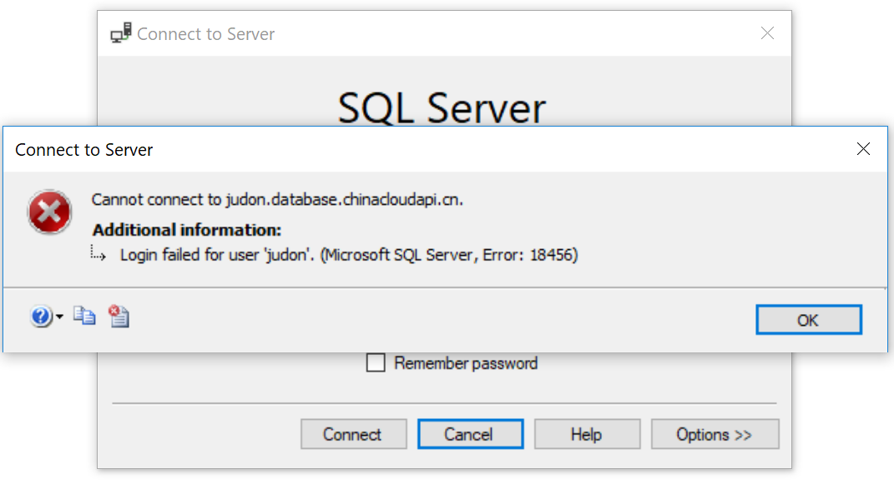
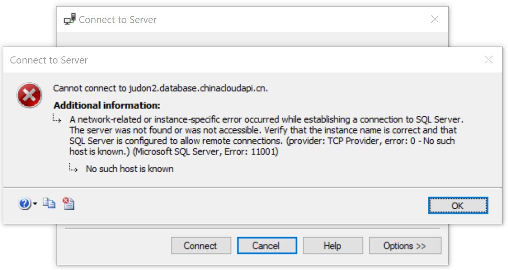
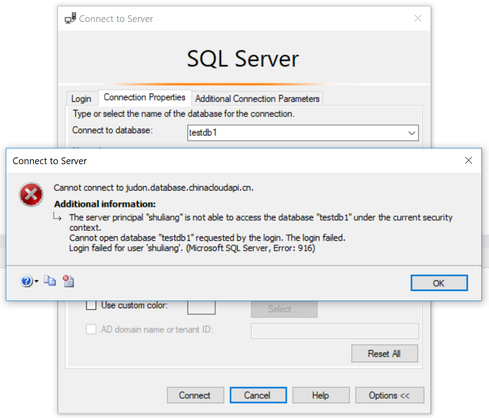
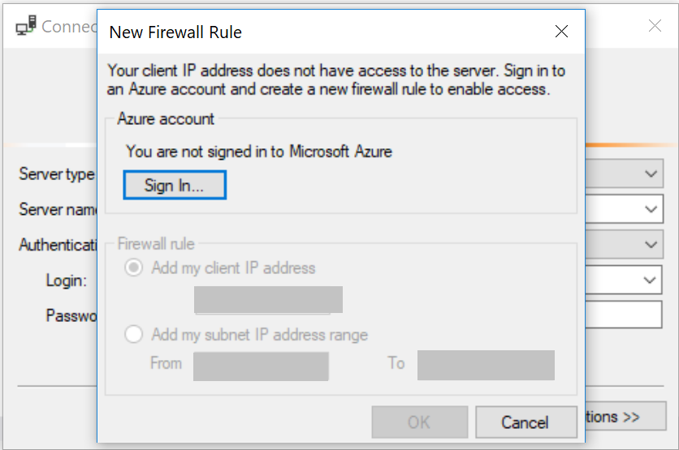

# Azure SQL 数据库常见的连接问题

这篇文章总结了常见的 Azure SQL 数据库连接失败的情况，主要分为 5 大类，旨在帮助用户或企业数据库管理员排查数据库连接异常的问题。

根据不同的情况，常见的连接问题有以下五种：

- 连接字符串问题
- Login/User 权限问题
- 防火墙设置问题
- 暂时性错误
- 启用了数据库表审核

## 连接字符串问题

1. 错误的 login 或密码

    如果在连接数据库的时候输入了错误的 login 或者密码，那么通常我们会看到如下报错：

    

    这时可以检查一下连接字符串或者 SSMS 客户端输入的 login 和密码是否正确。

2. 错误的服务器名称

    在遇到下面这种报错信息的时候，需要检查一下是否是服务器名称输入有误。

    

## Login/User 权限问题

如果使用的 Login 并没有访问目标数据库的权限，那么在尝试直接连接到这个数据库或者连接到 master 数据库后展开这个数据库的时候就会遇到下面这个错误：



这时候需要根据情况为这个 Login 创建一个 User，然后赋予这个 User 访问数据库的权限；或者直接更换一个有访问权限的账号进行连接。下面的例子是如何创建一个名为 testlogin 的 Login 并且赋予对数据库 testdb 的 read 权限：

```
--在 master 数据库下运行语句，创建名为 testlogin 的 Login
CREATE LOGIN testlogin WITH password='Pass@word1'; 

--切换到 testdb 数据库,创建名为 testuser 的 User
CREATE USER testuser FROM LOGIN testlogin;

--给新建的 testuser 添加 read 权限
EXEC sp_addrolemember 'db_datareader', 'testuser';
```

## 防火墙设置问题

1. IP 地址不在白名单中

    如果发起连接的客户端 IP 地址不在 Azure SQL Database 的 IP 白名单中，那么连接会失败。这时候需要登录到 [Azure 管理门户](portal.azure.cn)中添加相应的防火墙规则。

    

2. 在客户端和 Internet 之间的所有防火墙上面，确保 1433 端口的出站链接(outbound connection)是开放的。

## 暂时性错误

当应用尝试连接到 Azure SQL Database 的时候，如果收到了下面的错误信息：

```
Error code 40613: "Database <x> on server <y> is not currently available. Please retry the connection later. If the problem persists, contact customer support, and provide them the session tracing ID of <z>"
```

这种错误通常都是暂时性的。SQL Database 在需要动态调整硬件资源，或者有计划事件（例如软件更新）等情况下，会触发重新配置（reconfiguration），大多数的重新配置会很快完成，最多不超过 60s。针对这种暂时性的错误，可以有如下解决办法：

1. 应用端应该做好应对这种暂时性错误的准备，很重要的一点就是添加重试逻辑（retry logic）,在问题发生时进行重试而不是直接把报错抛给客户端/用户，有关重试逻辑的示例代码，可以参考：[SQL Azure Connection Retry](https://blogs.msdn.microsoft.com/bartr/2010/06/18/sql-azure-connection-retry/)

2. 当数据库的资源使用接近上限时，也可能造成暂时的连接问题。对于这种情况，可以通过管理门户的监控图表来及时发现资源不足的情况，根据实际需求调整服务级别。

## 启用了数据库表审核

在开启了Azure SQL Database Table Auditing 之后，对于下层客户端来说，需要修改连接字符串，否则会出现无法连接的情况。

> [!NOTE]
> 该问题只会出现在应用了 Table Auditing 的情况，而 Table Auditing 目前已经被弃用。对于 Blob Auditing，则不需要修改。

对于 “下层客户端”，即支持 TDS 7.3 版和更低版本的客户端 — 应修改连接字符串中的服务器 FQDN：

连接字符串中的原始服务器 FQDN：`<服务器名称>.database.chinacloudapi.cn`

连接字符串中修改后的服务器 FQDN：`<服务器名称>.database.secure.chinacloudapi.cn`

“下层客户端” 的部分列表包括：

- .NET 4.0 和更低版本，
- ODBC 10.0 和更低版本。
- JDBC（JDBC 虽然支持 TDS 7.4，但不完全支持 TDS 重定向功能）
- Tedious（适用于 Node.JS）

关于更多相关信息，可以参考：(SQL 数据库 - 针对审核的下层客户端支持和 IP 终结点更改)[https://docs.azure.cn/zh-cn/sql-database/sql-database-auditing-and-dynamic-data-masking-downlevel-clients]