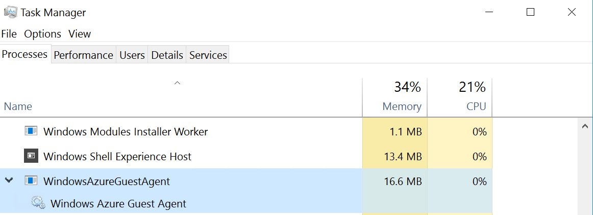
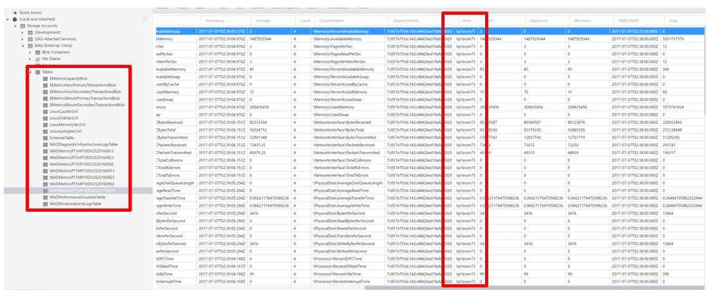

# Azure 虚拟机诊断设置问题排查

Azure 为用户提供了可以自己配置的性能监控功能：Azure 诊断扩展。但是在具体配置中，经常会遇到各种各样的问题。不了解监控的工作机制常常给排查带来一定难度。这里我们整理了关于 Azure 虚拟机监控的工作原理，以及在出现问题时的大致排查步骤，希望对读者和用户有所帮助。

以下是 Azure 诊断的简易原理图。简单来说，我们通过在门户中启用诊断，将配置信息发送给虚拟机中运行的 VM 代理。VM 代理收到请求后，进行 Azure 诊断扩展的安装和配置。然后，Azure 诊断根据配置文件，收集虚拟机中的性能数据等，并将其上传到存储账户对应的表中。最后，门户通过 Microsoft.insights 这个资源提供程序，从对应的存储账户中获取数据，并展现出来。Azure 警告可以根据这些监控数据进行告警设置，触发后续行动等。这个过程中的每个环节，每个应用和服务，缺一不可，才能保证监控能正常工作。


现在大家了解了基本的过程，那么在遇到性能数据无法显示的问题时，大概的思路也就很清楚了。

- [检查诊断扩展是否安装成功](#section1)
- [检查诊断配置文件是否正确](#section2)
- [检查存储账号是否有性能数据](#section3)
- [检查订阅是否注册了 Microsoft.insights](#section4)

## <a id="section1"></a>检查诊断扩展是否安装成功

### 检查

最简单的检查方法，就是在门户中查看扩展状态。

虚拟机中的 Extensions 边栏里列出了该虚拟机安装的所有扩展。诊断扩展在 Linux 系统中为 LinuxDiagnostic; 在 Windows 系统中为 IaaSDiagnostic。

若状态为 **Provisioning succeeded**，则说明扩展安全成功。若是其他状态如 **Not Available** 或者 **Failed**，则说明安装可能有问题。这时就需要排查安装问题。


### <a id="troubleshooting"></a>问题排查

由于 Azure 对虚拟机的管理都是通过 VM Agent 来完成的。因此，安装不成功的大多数原因都在于 VM Agent 工作不正常。那么如何检查呢？

- Linux

    以 root 身份运行下面命令，查看 VM Agent 的版本，系统版本，Python 版本和运行状态。

    ```
    # waAgent -daemon
    2017/07/19 12:19:19.184938 INFO Azure Linux Agent Version:2.2.13
    2017/07/19 12:19:19.189233 INFO OS: centos 7.3.1611
    2017/07/19 12:19:19.194076 INFO Python: 2.7.5
    2017/07/19 12:19:19.198558 INFO Daemon is already running: 808
    ```

    1. 检查代理版本和状态

        默认情况下，系统会自动更新版本到最新版。请参考 [WALinuxAgent](https://github.com/Azure/WALinuxAgent/releases) 查看是否是最新的版本。在排查问题过程中，建议首先尝试将 VM Agent 升级到最新版本后再继续操作。参考[文档](https://github.com/Azure/WALinuxAgent) 进行 VM Agent 的安装和升级。

        若当时虚拟机中 VM Agent 服务处于停止状态，以 root 身份执行下面命令进行启动：

        `# waAgent -start`

    2. 如果是经典模式虚拟机，您还需要检查虚拟机是否启用了 VM Agent。如果未更新 Azure 虚拟机的配置文件，即使安装成功，Azure 也无法判断您是否安装了 VM Agent，因此也不会使用该 Agent 进行扩展管理。

        以下步骤需要在 AzurePowershell 中执行。首先判断 VM 是否已经设置了启用 VM Agent：

        ```
        $vm = Get-AzureVM -ServiceName $serviceName -Name $vmname
        “$vm.VM.ProvisionGuestAgent”
        ```

        如果 `$vm.VM.ProvisionGuestAgent` 为 `true`，说明 VM 已启用 VM Agent。剩余步骤即可跳过。
        如果 `$vm.VM.ProvisionGuestAgent` 为 `false`，说明尚未启用 VM Agent。执行以下命令启用：

        ```
        $vm = Get-AzureVM -serviceName $serviceName -Name $vmname $vm.VM.ProvisionGuestAgent = $TRUE
        Update-AzureVM -Name $name -VM $vm.VM -ServiceName $svc
        ```

    在 VM Agent 工作正常的情况下，诊断扩展依旧安装不成功，则需要通过日志来排查问题。 **/var/log/waAgent.log** 是 VM Agent 的日志输出，日志中会记录所有的虚拟机通过 VM Agent 与 Azure 平台的交互。

- Windows

    1. 查看 VM Agent 是否安装。

        **C:\WindowsAzure\Packages** 是否有 WaAppAgent 这个应用程序。若没有安装，请参考[VM Agent 和扩展程序](https://www.azure.cn/blog/2014/04/28/vm-Agent-and-extensions) 的 **VM Agent 和扩展程序 - 第 2 部分** 进行安装和配置。

    2. 经典虚拟机需要同时检查 VM Agent 是否在虚拟机中启用，具体参见 Linux 部分[问题排查](#troubleshooting)）。

    3. 任务管理器中查看 WindowsAzureGuestAgent 是否运行。
    
        若没有截图中的进程，说明 VM Agent 可能没有运行。点击 **C:\WindowsAzure\Packages** 中的应用程序 **WaAppAgent** 进行启动。

        

        同时避免重启后 VM Agent 不会自动启动，在服务管理中查看该服务是否设置为自动启动。
        
        

若运行不正常，请提供以下日志以供排查：

```
C:\WindowsAzure\Logs
C:\Packages\Plugins\Microsoft.Azure.Diagnostics.IaaSDiagnostics\<version>\*
```

关于 Windows VM agent 的更多信息，请参考 [Azure 虚拟机代理概述](https://docs.azure.cn/zh-cn/virtual-machines/virtual-machines-windows-agent-user-guide) 及 [VM Agent 和扩展程序](https://www.azure.cn/blog/2014/04/28/vm-agent-and-extensions)。

## <a id="section2"></a>检查诊断配置文件是否正确

通过门户配置的诊断扩展，平台会首先验证用户的输入，再给 VM Agent 发送标准的配置，因此扩展配置一般不会有问题。但有些用户可能希望使用 PowerShell 脚本来启用扩展，这样可以自定义一些需要保存的日志文件，或者添加删除某些性能指标；在这种情况下，若配置文件设置不当，很可能造成扩展安装成功，但工作不正常的情况。

### 通过查看扩展日志来找到原因：

Linux 中日志位于 **/var/log/azure/Microsoft.OSTCExtensions.LinuxDiagnostic/<version>/** 下面，extension.log 记录了所有的配置变更，以及错误信息。根据错误信息进行配置文件的修正，一般能解决大多数问题：如性能指标写的不对；存储账号密、SAS 配置错误等。

Windows 中日志位于 **C:\Packages\Plugins\Microsoft.Azure.Diagnostics.IaaSDiagnostics\<version>\Status** 中。

如果在更新了 VM agent 版本，重启 Waagent 服务，甚至重启了虚拟机的情况下，安装扩展仍然出现问题，或者扩展仍然无法正常工作，请将下面日志打包提供：

```
Linux：
/var/log/waagent.log
/var/log/azure/Microsoft.OSTCExtensions.LinuxDiagnostic/<version>/*
/var/lib/waagent/*.xml
 
Windows:
C:\WindowsAzure\Logs
C:\Packages\Plugins\Microsoft.Azure.Diagnostics.IaaSDiagnostics\<version>\*
```

## <a id="section3"></a> 检查存储账号是否有性能数据

若诊断扩展运行正常，则对应的存储账号中将会存在对应的存放性能数据的表。且表中会有虚拟机的性能数据存在。

使用 Microsoft Azure Storage Explorer 连接到存储账户，展开 Tables 检查表。用于存放性能数据的表以 WADMetrics 开头。根据存放的性能数据的时间频度，后跟 PT1M 或者 PT1H，分别代表过去一分钟和过去一小时。该表每 10 天会新建一个，因此，P10D 代表存最最多存放 10 天的数据。最后是表的版本和最新数据的时间段。如 WADMetricsPT1HP10DV2S20170510 代表该表存放的是 2017 年 05 月 10 日之前 10 天内的每小时的统计数据。

表中的数据，一行为某个虚拟机的某个时间点的单个性能指标的统计数据。其中记录了虚拟机名，时间戳，性能指标名称，时间范围内的采样次数，最大值，最小值，平均值，以及总量。

> [!NOTE]
> 对于不同的性能指标，并不是每一列都会用到。

在排查性能视图不可见的问题时，用户首先要明确的是什么时间段的数据不可见，然后找到对应的表，查看表中是否有虚拟机的对应时刻的性能指标记录。由于表中包含数以万计的实体，您可以使用 Microsoft Azure Storage Explorer 提供的过滤功能筛选结果，但由于单次下载到内存中的数据并不多，不一定能查到所需数据；在这种情况下，建议将表导出到本地 csv 文件中进行筛选。

如果表中确实没有对应的数据，则需要再次[检查配置文件](section2)确认存储账号设置是否有误，或者数据上传是否有错。如果是上传错误，在 VM agent 的日志，或者扩展日志中将会有对应的记录。



## 检查订阅是否注册了 Microsoft.insights

通过以上步骤的排查，但数据依旧没有显示，则最大的可能性就是负责处理性能数据显示的资源提供程序 Microsoft.insights 没有注册，导致门户无法获取和处理数据。检查方法如下：

门户中搜索 Subscription。打开后点击对应的订阅，在 Resource  Providers 边栏中查看 Microsoft.insights 是否是注册的状态。若没有注册，点击注册将其注册到订阅中。再回到虚拟机页面查看性能视图。


## 在线提交工单

如果上述所有操作都尝试过，但还是有问题，请收集下面信息提供给[技术支持团队](https://www.azure.cn/support/support-ticket-form/?l=zh-cn)进行个案分析。

```
Linux：
/var/log/waagent.log
/var/log/azure/Microsoft.OSTCExtensions.LinuxDiagnostic/<version>/*
/var/lib/waagent/*.xml
 
Windows:
C:\WindowsAzure\Logs
C:\Packages\Plugins\Microsoft.Azure.Diagnostics.IaaSDiagnostics\<version>\*
```