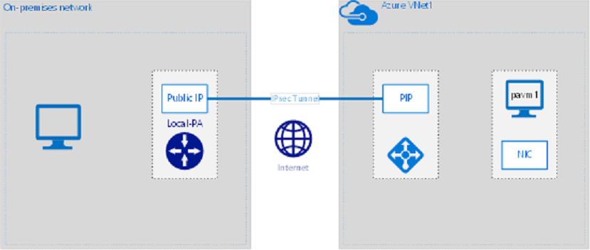
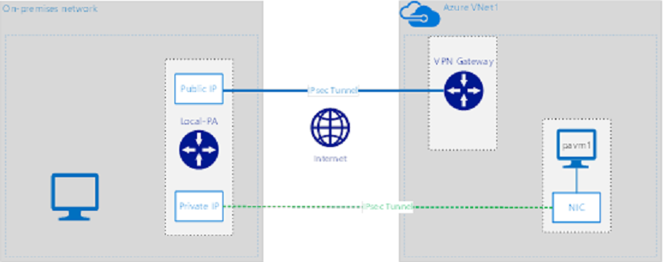
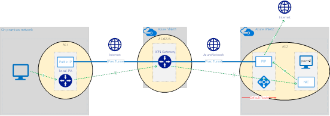

随着 Azure 平台用户越来越多，同时需求也越来越广泛，其中之一就是网络架构上的需求，比如需要强大的应用层防火墙，网络访问控制管理，网络安全认证，出口网关统一等，而用户为了满足架构需求，希望借助第三方网络设备厂商来兼容 Azure 的网络服务来实现。虽然看起来是一个很好的方式，但是其中存在着很多兼容问题以及需要通过实践来测试架构上的可信性.

很幸运，有机会需要实现 Azure 和 Palo Alto Network 之间的结合来满足客户的需求，从而借此机会把经验分享给大家，希望对大家以后的工作和项目有所帮助.

内容说明：
1. 以下内容不涉及太多技术分析，以结果为主
2. 如今 Cloud 产业更新快速，因此不排除 Azure 与厂商之间兼容性会存在变化
3. 不涉及太多的 Palo Alto 的产品介绍，如果你选择的厂商技术特点与之类似，本人认为可以借鉴
4. 以下内容涉及到部分 Azure 基本知识，如果对某些服务不了解请查询官方文档
5. 以下内容针对的都是新门户服务和环境，无法保证经典门户都能够实现

环境介绍：
1.	由厂商 Palo Alto 提供如下资源.
    * Azure 的VHD 镜像文件：软件版本号为7.1.10
    * 提供在 Azure 上部署的 Template 配置文件：多网卡并属于不同的子网
    * 产品 License 用于激活

2.	用提供的 VHD 创建 Azure 的 VM
    * 使用 azcopy 将 VHD 镜像上传到 Storage Account
    * 通过 Powershell/Portal/CLI 使用 Template 配置文件部署 VM
    * 保证内网地址可以 ICMP 可达
    * 保证从外网通过 Azure VM 的VIP地址访问到 Palos Alto 的 Web 管理界面
3.	注意点
    *  Palo Alto 提供的配置文件并不一定是一站式部署，很多资源可能需要自己去创建，比如存储账号，虚拟网络，子网，资源组等
    * 注意配置文件中的一些资源的参数可能会和你创建的资源有冲突，请仔细核对，比如存储账号里面的 SKU

建立 IPsec 隧道场景介绍
1. 不同 VNet 的 NVA 之间建立 IPsec 隧道

	部署步骤
    * pavm1 ：通过 Palo Alto 的 VHD 镜像创建出来的 Azure VM1，并属于 VNet1
    * pavm2 ：通过 Palo Alto 的 VHD 镜像创建出来的 Azure VM2，并属于 VNet2
    * VNet Gateway 之间建立 VNetToVNet 连接
    * 基于 VNetToVNet 连接，pavm1 与 pavm2 建立 IPsec 隧道
    * 在 IPsec 隧道的基础上实现路由传递
2. Azure NVA 与本地 Palo Alto 设备建立 IPsec 隧道

	部署步骤
    * pavm1 ：通过 Palo Alto 的 VHD 镜像创建出来的 Azure VM1，并属于 VNet1
    * Local-PA ：拥有独立公网地址的 Palo Alto 硬件设备，目前没有发现版本兼容性问题
    * pavm1 的网卡绑定 PIP 地址
    * Local-PA 通过 Internet 与 pavm1 的 PIP 建立 IPsec 隧道
    * 在 IPsec 隧道的基础上实现路由传递：BGP或者静态
3. 通过 VPN Gateway 来实现本地 Palo Alto 设备与 Azure NVA 之间建立 IPsec 隧道
 
    部署步骤
    * pavm1：通过 Palo Alto 的 VHD 镜像创建出来的 Azure VM1，并属于 VNet1
    * Local-PA：拥有独立公网地址的 Palo Alto 硬件设备，目前没有发现版本兼容性问题
    * Local-PA 通过 Internet 与 VPN Gateway 建立基于路由的 IPsec 隧道并传递内网路由
    * 基于此 IPsec 隧道，Local-PA 的私有地址与 pavm1 的私有地址建立 IPsec 隧道
    * 在 IPsec 隧道的基础上实现路由传递

从以上介绍可以看出，基于 NVA 来建立 IPsec 隧道方式有多种，需要根据自身的网络架构需求来选择最适合的方式，以下介绍一个较复杂的需求供各位参考：让本地网络去往 Internet 的流量通过 Azure 出口进行转发
 
 
部署步骤：
* pavm2：通过 Palo Alto 的 VHD 镜像创建出来的 Azure VM2，并属于 VNet2
* Local-PA：拥有独立公网地址的 Palo Alto 硬件设备，目前没有发现版本兼容性问题
* Local-PA 通过 Internet 与 VNet1 中的 VPN Gateway 建立基于路由的 IPsec 隧道并建立 EBGP 邻居
* VNet1 中的 VPN Gateway 与 pavm2 的 PIP 建立 IPsec 隧道并建立 EBGP 邻居
* pavm2 在 BGP 路由协议中通告默认路由
* pavm2 配置 NIC 的默认路由
* pavm2 配置 NAT 条目，封装来自本地网段的源地址为 NIC 的地址

本地网络 Internet 流量走向（绿色箭头）：
1. 本地网络通过内部路由转发到 Local-PA
2. Local-PA 根据从 BGP 学到的默认路由转发到 VPN Gateway
3. VPN Gateway 根据从 BGP 学到的默认路由转发到 pavm2
4. pavm2 根据配置的 NIC 的默认路由丢给 PIP，并将源地址封装成 NIC 地址
5. 将源地址转化成 PIP 地址丢到公网

分析：
* 为了网络的扩展性，让其中一个 VNet 中的 VPN Gateway 作为网络 Hub 是一个比较可行的方式
* BGP 路由协议是目前 VPN Gateway 唯一支持的动态路由协议
* 由于 Azure VM 的公网地址并不是直接绑定到 VM 上，而是对 VM 的 NIC 地址进行 NAT 的地址转化，因此如果将 VM 作为路由器，还需要对转发的流量进行 NAT 转化
* 实现的方式有多种，各自都有利弊

目前以下方式无法实现
1. 由于 Azure VM 网络禁用 GRE 协议，因此任何基于 GRE 的隧道技术都无法实现
2. 避免在 VNet 中的 VPN Gateway 与同一个 VNet 中的 pavm 建立 BGP 邻居并传递路由，可能会造成环路

小结：
如果你的网络架构会参考到部分文章内容，请进行测试评估后再考虑部署，在部署过程中可能会遇到一些小问题，这里不会进行扩展讨论，请咨询相关厂商和 Azure 技术支持。
