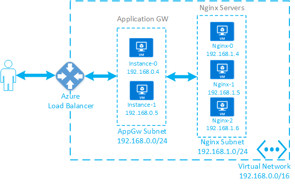
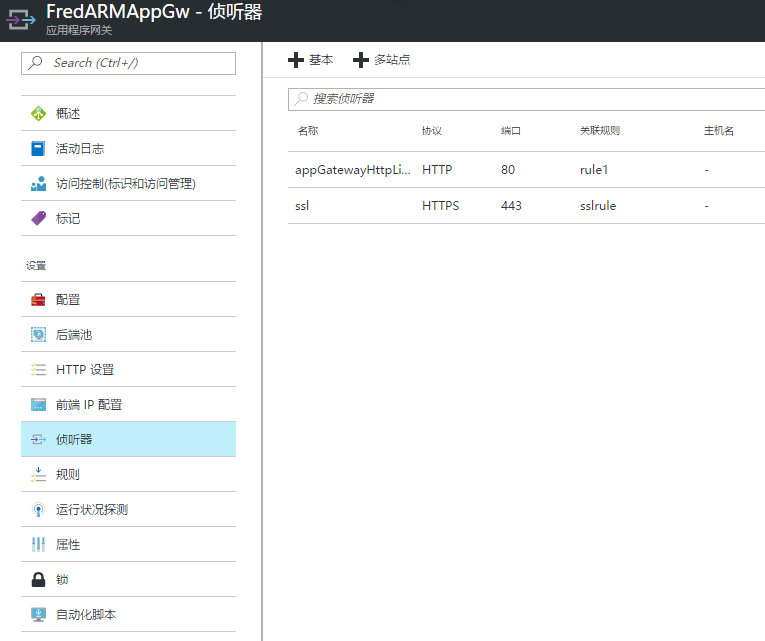
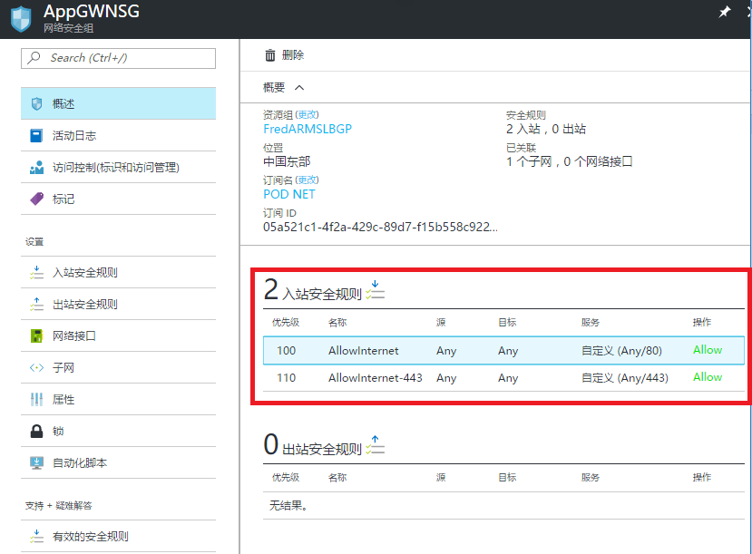
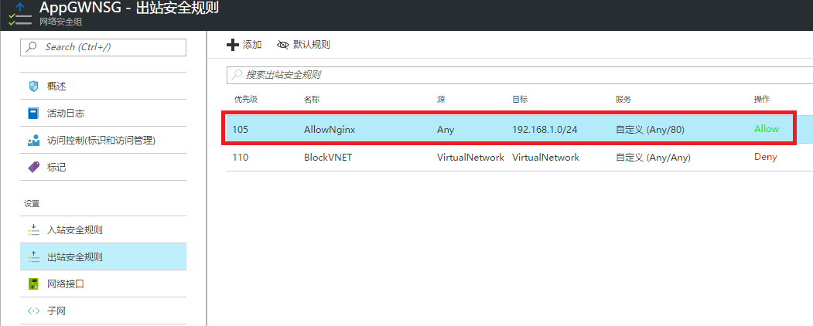
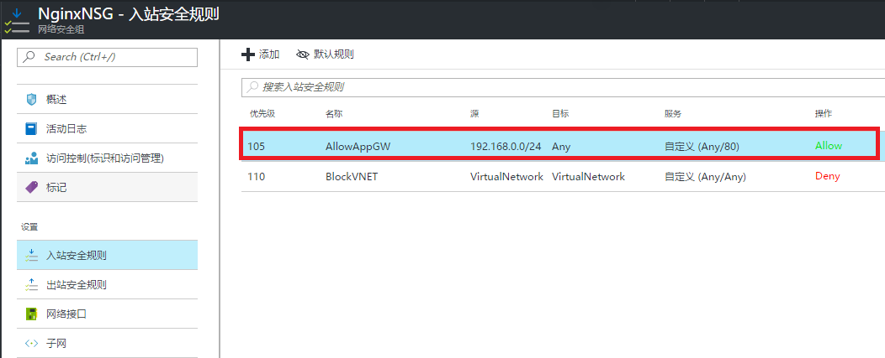
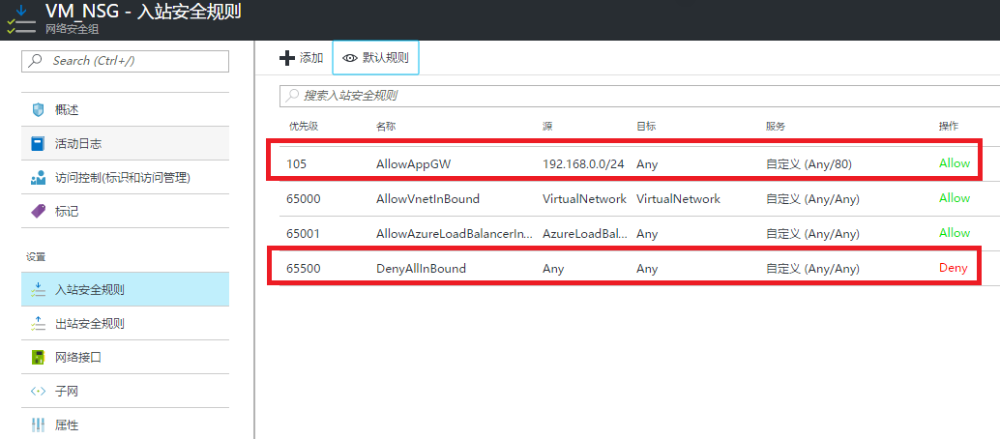

<properties
    pageTitle="使用应用程序网关的环境下配置 NSG 的注意事项"
    description="使用应用程序网关的环境下配置 NSG 的注意事项"
    service=""
    resource="applicationgateway"
    authors="Fred Li"
    displayOrder=""
    selfHelpType=""
    supportTopicIds=""
    productPesIds=""
    resourceTags="Application Gateway, NSG"
    cloudEnvironments="MoonCake" />
<tags
    ms.service="application-gateway-aog"
    ms.date=""
    wacn.date="03/16/2017" />
# 使用应用程序网关的环境下配置 NSG 的注意事项

<table>
<tr>
    <th>物理点</th>
    <th>通讯包</th>
    <th>说明</th>
</tr>
    <td>客户端</td>
    <td>[1.2.3.4]:random <->[AppGW VIP]:80</td>
    <td>客户端只有跟应用程序网关公网 IP 之间的通讯包。</td>
<tr>
    <td rowspan="2">应用程序网关实例</td>
    <td>[1.2.3.4]:random <->[192.168.0.4|192.168.0.5]:80</td>
    <td>由于 Azure 层面的 NAT，客户端发包的目的地址被转化成应用程序网关的实例地址。</td>
</tr>
<tr>
    <td>[192.168.0.4|192.168.0.5]:random <-> [192.168.1.4|192.168.1.5|192.168.1.6]:80</td>
    <td>应用程序网关发起新的 TCP 连接向后端服务器发起数据请求。这里的发包也包括应用程序网关发出的健康探测包。</td>
</tr>
<tr>
    <td>后端服务器</td>
    <td>[192.168.0.4|192.168.0.5]:random <-> [192.168.1.4|192.168.1.5|192.168.1.6]:80</td>
    <td>后端服务器对应用程序网关的请求进行回复。</td>
</tr>
</table>

## 背景介绍

大家在使用应用程序网关时，出于对安全方面的考虑，经常会进行一些额外的 NSG 配置来减小系统暴露在互联网上所带来的风险。如果大家对 Azure 应用程序网关的工作原理不甚了解，在配置 NSG 的时候经常会导致应用程序网关无法正常访问。本文通过对应用程序网关工作原理的介绍，阐述在使用应用程序网关的环境下配置 NSG 的注意事项。

## 应用程序网关工作原理

Azure 应用程序网关采用的是类似于反向代理服务器的工作方式，客户端直接访问应用程序网关的公网地址而无法感知后端实际的服务器。当应用程序网关接收到客户端的请求之后，它会以自身实例在虚拟网络内部的地址作为源地址对后端池内部的服务器发起新的请求来获取数据，再将获取的数据通过原先跟客户端建立的连接返回给客户端。

如上图所示，我们部署了三台 Nginx 服务器在应用程序网关后端。应用程序网关部署在 AppGw 子网之内，Nginx 服务器部署在 Nginx 子网之内。应用程序网关本质上是由多个虚拟机实例组成的群集，默认情况下建立的应用程序网关包含两个实例，每个实例都会占用子网内的一个地址，如上图所示**实例 -0** 占用地址 192.168.0.4，**实例 -1** 占用地址 192.168.0.5。当客户端对应用程序网关发起请求时，Azure 前端的负载均衡器会将请求发送到对应的应用程序网关实例，应用程序网关上面的服务会以实例本身的内网地址向后端服务器发起新的请求。比如客户端的请求被发送到**实例-0**，该实例会以 192.168.0.4 作为源地址对后端服务器发起请求。

如果客户端所用的公网 IP 地址为 1.2.3.4， 应用程序网关开放的是公网 80 端口，应用程序网关与后端服务器也使用 80 端口进行通信，则在每个物理点的实际网络数据应该类似于下表所示。

|      物理点      |                                                                        通讯包 |                                                 说明                                        |
|:----------------:|:------------------------------------------------------------------------------:|:------------------------------------------------------------------------------------------|
| 客户端           | [1.2.3.4]:random <->[AppGW VIP]:80                                            | 客户端只有跟应用程序网关公网 IP 之间的通讯包。                                                   |
| 应用程序网关实例  | [1.2.3.4]:random <->[192.168.0.4|192.168.0.5]:80                              | 由于 Azure 层面的 NAT，客户端发包的目的地址被转化成应用程序网关的实例地址。                         |
| 应用程序网关实例  | [192.168.0.4/192.168.0.5]:random <-> [192.168.1.4/192.168.1.5/192.168.1.6]:80 | 应用程序网关发起新的 TCP 连接向后端服务器发起数据请求。这里的发包也包括应用程序网关发出的健康探测包。 |
| 后端服务器       | [192.168.0.4/192.168.0.5]:random <-> [192.168.1.4/192.168.1.5/192.168.1.6]:80 | 后端服务器对应用程序网关的请求进行回复。                                                       |

## 配置 NSG 时的注意事项

一般来说，在使用应用程序网关的环境下配置 NSG 有以下几个注意事项。

1. 应用程序网关实例所在的子网 NSG 需要允许互联网对前端服务端口的访问。
2. 应用程序网关实例所在的子网需要能够与后端服务器所在的子网进行通讯。
3. 后端服务器网卡绑定的 NSG 需要允许应用程序网关实例所在的子网对后端服务端口的访问。

下面对这几个注意事项进行详细的描述。

1. 应用程序网关实例所在的子网需要允许互联网对前端服务端口的访问

    在使用应用程序网关的环境下，应用程序网关实例会接收所有公网访问的流量，所以必须对应用程序网关实例所在的子网放行互联网对前端服务端口的访问。

    比如我们配置应用程序网关启用了 80 和 443 端口的侦听器如下所示。

    

    当应用程序网关实例所在的子网启用了 NSG 时，如下图所示，我们至少需要在入站规则里面开放公网对 80 端口以及 443 端口的允许访问规则。

    

    NSG 规则里面的目标地址必须选为 Any 而不要设定为某些固定的内网 IP 地址，这主要是因为应用程序网关实例所占用的内网地址是动态分配的，而且如果修改了应用程序网关的实例个数也会导致应用程序网关占用更多的子网里面的 IP 地址，这样就会导致规则无法应用到所有的应用程序网关实例。

2. 应用程序网关实例所在的子网需要能够与后端服务器所在的子网进行通讯

    对于绑定到虚拟网络子网的 NSG 来说，其在创建的时候会添加如下图所示的默认规则来允许虚拟网络内部的通信（查看时需要点击“默认规则”按钮）。如果没有配置新的规则来覆盖这个优先级为 65000 的规则时，一般不会出现问题。

    

    但当我们在虚拟网络的子网之间配置了 NSG 策略来进行访问控制时，我们至少要保证下面两点：

    1. 应用程序网关实例所在的子网 NSG 的出站安全规则放行对后端服务器服务端口的访问
    2. 后端服务器所在的子网 NSG 的入站安全规则放行应用程序网关实例所在的子网的访问请求。

    比如在上面提到的测试环境中，我这边将名为 AppGWNSG 的 NSG 绑定到应用程序网关实例所在的子网，并将名为 NginxNSG 的 NSG 绑定到后端服务器所在的子网。

    对于 AppGWNSG，入站和出站规则我这边都添加了一条优先等级为 110 的 Deny 规则来禁止虚拟网络之间的通信，用此来模拟用户场景中可能出现的虚拟网络内部的流量控制策略。我们至少要在 AppGWNSG 的出站安全规则中添加更高优先级的规则来放行应用程序网关到后端服务器服务端口的访问。比如我这边建立优先级为 105 的名为 AllowNginx 的规则，允许访问 Nginx Subnet 192.168.1.0/24 网段的 80 端口。如果后端服务器不是监听在 80 端口，需要更改为对应端口或者配置为 Any(*)。

    

    同样的对于 NginxNSG，在入站和出站规则我这边都添加了一条优先等级为 110 的 Deny 规则来禁止虚拟网络之间的通信，用此来模拟用户场景中可能出现的虚拟网络内部的流量控制策略。我们同样也需要在入站安全规则里面添加更高优先级的规则来放行应用程序网关到后端服务器的访问。比如我这边建立优先级为 105 的名为 AllowAppGW 的规则，允许来自于 AppGW subnet 192.168.0.0/24 网段 访问 80 端口的流量。同样的，如果后端服务器不是监听在 80 端口，也需要更改为对应端口或者配置为 Any(*)。

    

    3. 后端服务器网卡绑定的 NSG 需要允许应用程序网关实例所在的子网对后端服务端口的访问

    如果后端服务器的网卡绑定了 NSG，我们也需要在 NSG 中配置访问策略来允许应用程序网关的访问。从前面的分析中我们知道应用程序网关会以实例的内网地址向后端服务器进行访问请求以及健康探测，所以我们只需要在入站规则中放行应用程序网关实例所在的子网对服务器服务端口的访问就行，而不需要开放公网对服务端口的访问。

    如下图所示，我这边将名为 VM_NSG 的 NSG 绑定到后端服务器，我们只需要在入站安全规则里面添加允许源为 AppGW subnet192.168.0.0/24 网段的访问即可。可以看到 NSG 默认会阻止来自于 Internet 的访问，在这种配置下应用程序网关仍然能够正常工作。

    
