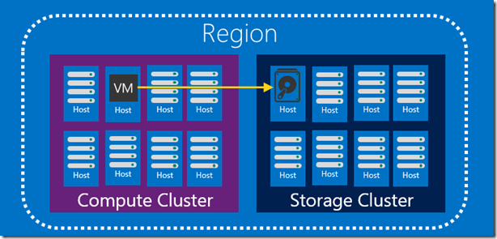
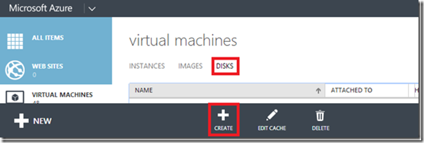
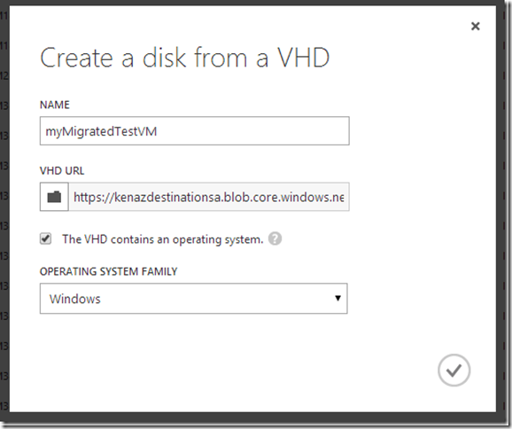
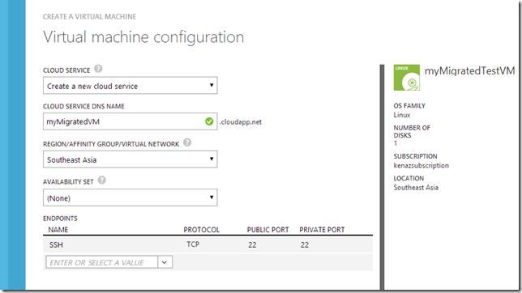

# 如何将虚拟机迁移至新的存储账户 #

我们在使用 Azure 虚拟机的过程中，有时会需要把 Azure 虚拟机的相关 VHD 文件从现有的存储账户迁移到其它存储账户。在讨论如何进行该操作之前，我们先来回顾一下 Azure 虚拟机的一些基本概念。首先，对于 Azure 虚拟机在设计上是把计算和存储分离开的，所以在创建一台 Azure 虚拟机时，我们会使用到两个服务：计算和存储, 所有持久 VHD（系统盘，数据盘 VHD 文件）都是创建在 Azure 存储里的，而不是直接创建在虚拟机所处于的物理节点上的。虚拟机启动的时候，会直接从存储账户里的 VHD 文件启动引导操作系统，存储账户中 VHD 文件本质上是一个 blob 文件。其次，创建虚拟机的时候，Azure 只允许把 VHD 创建在和虚拟机在同一个区域（比如北京或者上海的数据中心）的存储里，这主要是为了保证计算节点和存储之间的网络延迟尽可能小，从而保证虚拟机的 IO 性能。

通过以上信息的了解，可以更好的帮助我们理解虚拟机迁移流程：

1. 关闭虚拟机
2. 将 VHD 文件 从源区域的存储账户复制到目标区域的存储账户
3. 通过该 VHD 文件创建虚拟机磁盘
4. 从磁盘重新创建虚拟机并启动

## 关闭虚拟机 ##

在[经典管理门户](https://manage.windowsazure.cn/)界面，选择需要迁移的虚拟机，在控制菜单中选择关闭虚拟机选项。

或者，您也可以使用 Azure PowerShell cmdlet 来完成相同的操作：

	$servicename = "KenazTestService"
	$vmname = "TestVM1"
	Get-AzureVM -ServiceName $servicename -Name $vmname | Stop-AzureVM

当您进行复制操作时需要关闭虚拟机以保证文件系统的一致性，从而避免新的 VHD 文件不能正常启动的情况。 Azure 目前还不支持虚拟机的实时迁移。如果只是将 VHD 文件直接拷贝，那么意味着您所迁移的是一个专用的虚拟机。如果您想要通过一个通用的映像创建虚拟机，那么在虚拟机关闭之前您需要使用系统准备工具（sys-prep）对映像进行初始化操作。 

## 复制 VHD 文件 ##

Azure 存储服务提供了将 Blob 从一个存储账户移动到另一个存储账户的功能，所以要完成 VHD 文件迁移只需要明确以下步骤即可：

1.	确定源存储账户信息；
2.	确定目标存储账户信息；
3.	确保目标存储账户中存在目标容器；
4.	执行 Blob 复制操作。

>注意：跨区域复制 Blob 时，如果您复制的 Blob 较大，有可能会出现花费时间比较长的情况。此时更好的方法是通过 Azure PowerShell 进行操作，因为 PowerShell 的 Start-AzureStorageBlobCopy 命令是一个异步命令，也就是说调用后会立刻返回。

	Select-AzureSubscription "kenazsubscription" 
	
	# VHD blob to copy #
	$blobName = "KenazTestService-TestVM1-2014-8-26-15-1-55-658-0.vhd" 
	
	# Source Storage Account Information #
	$sourceStorageAccountName = "kenazsa"
	$sourceKey = "MySourceStorageAccountKey"
	$sourceContext = New-AzureStorageContext –StorageAccountName $sourceStorageAccountName -StorageAccountKey $sourceKey  
	$sourceContainer = "vhds"
	
	# Destination Storage Account Information #
	$destinationStorageAccountName = "kenazdestinationsa"
	$destinationKey = "MyDestinationStorageAccountKey"
	$destinationContext = New-AzureStorageContext –StorageAccountName $destinationStorageAccountName -StorageAccountKey $destinationKey  
	
	# Create the destination container #
	$destinationContainerName = "destinationvhds"
	New-AzureStorageContainer -Name $destinationContainerName -Context $destinationContext 
	
	# Copy the blob # 
	$blobCopy = Start-AzureStorageBlobCopy -DestContainer $destinationContainerName `
	                        -DestContext $destinationContext `
	                        -SrcBlob $blobName `
	                        -Context $sourceContext `
	                        -SrcContainer $sourceContainer

通过执行以上命令将会开始从您的源账户向目标账户进行 Blob 的复制操作，此时您需要稍作等待以确保 Blob 能够完全的复制。如您需要查看该操作的状态，可以通过 `Get-AzureStorageBlobCopyState` 命令获取复制的最新进度：

	while(($blobCopy | Get-AzureStorageBlobCopyState).Status -eq "Pending")
	{
	    Start-Sleep -s 30
	    $blobCopy | Get-AzureStorageBlobCopyState
	}

}
在完成 Blob 拷贝操作后，该状态即便为“成功”。更详细的 VHD 拷贝操作示例可以参考  “[Azure 虚拟机: 跨存储账户拷贝 VHDS](https://docs.microsoft.com/en-us/azure/storage/storage-use-azcopy)” 。

## AzCopy 复制 Blob ##

同样我们可以使用 AzCopy 工具（[下载地址](http://aka.ms/downloadazcopy)）完成 Blob 的复制操作。如下是存储账户间的 Blob 复制命令：

	mycontainer1 https://destaccount.blob.core.windows.net/mycontainer2 /sourcekey:key1 /destkey:key2 abc.txt

关于如何使用 AzCopy 工具更详细的参考资料: “[使用AzCopy工具移动数据](https://docs.microsoft.com/zh-cn/azure/storage/storage-use-azcopy)”。

## 创建虚拟机磁盘 ##

此时您复制到目标存储账户中的仅仅是一个 Blob， 您需要创建一个虚拟机磁盘以让虚拟机可以从该 Blob 启动。在经典管理门户中选择“磁盘”标签页，并且点击“创建”以完成虚拟机磁盘的创建工作。

>注意：以上操作是用来加载未进行一般化操作的 VHD 文件，如您想要使 VHD 作为映像来加载，您需要重启虚拟机，通过 sysperp 工具进行初始化，复制 Blob，最后添加该 Blob 为映像（而非磁盘）。

在 VHD URL 选项处选择目标容器中复制过来的 Blob，勾选上“ VHD 包含操作系统”，该选项表明您所创建的磁盘对象是用作 OS 磁盘使用的，而非作为数据磁盘使用。

>注意：如果在附加磁盘时遇到该错误提示“ Blob 出现冲突….”，您需要返回上一步确保复制操作已经完成。

同样您也可以通过 执行 PowerShell 命令来进行该操作。

	Add-AzureDisk -DiskName "myMigratedTestVM" `
	            -OS Linux `
	            -MediaLocation "https://kenazdestinationsa.blob.core.windows.net/destinationvhds/KenazTestService-TestVM1-2014-8-26-16-16-48-522-0.vhd" `
	            -Verbose

以上步骤完成后，在虚拟机磁盘标签页就会出现您刚刚创建的磁盘。

## 创建虚拟机 ##

此时您可以使用刚刚创建好的磁盘来创建虚拟机，在经典管理门户中，选择从库中创建虚拟机并且选择您刚刚创建好的磁盘。

>注意：如果您迁移的虚拟机已有一个已经配置好的存储池（或者您需要磁盘驱动器的字母排序与之前一致），则您需要记录下源虚拟机的 VHD 的 LUN 编号，并且确保数据磁盘在目标虚拟机上对应了正确的 LUN 编号。

现在您的虚拟机已经在目标存储账户中可以正常运行了。

