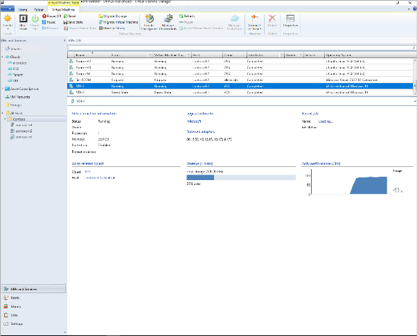
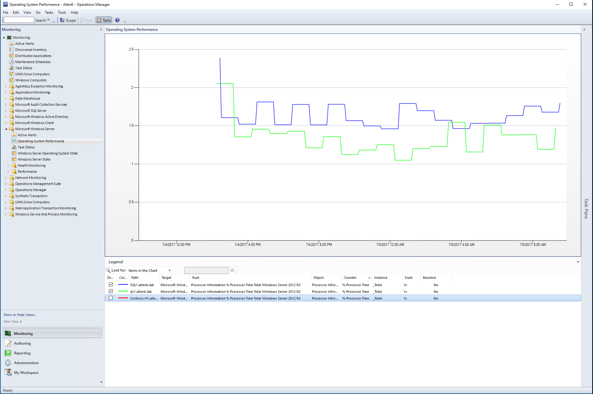
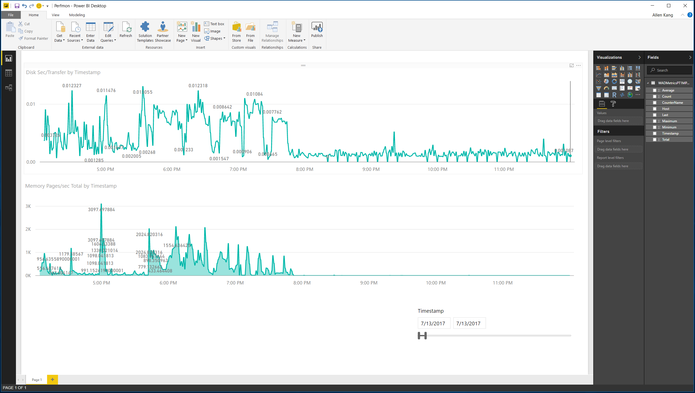

# 理解 Azure 虚拟机的负载监控

## 简介

在公有云计算平台上，其中重要的一项基本特征为扩展性（scalability），无论是 IaaS 或是 PaaS 服务，都可能需要根据实际生产负载来实现资源部署的缩放。

在 IaaS 层面，无论是之前 ASM 的云计算结构，还是在 ARM 模式下最新的虚拟机集（VMSS）功能中，都提供了根据虚拟机的性能指标来实现资源的动态缩放。为了实现这个功能，技术上的一个前提条件是云计算平台可以提供准确、及时的性能指标来作为缩放的依据。本文详细介绍一下 Azure 平台上如何收集虚拟机的性能数据。

众所周知，Azure 平台的 Hypervisor 是 Hyper-V 服务器，其上运行的虚拟机涵盖 Windows 以及 Linux 的各个发布版本。在这种架构下，如果需要收集虚拟机的性能数据，一定是通过以下两种方式之一实现：

- 虚拟机的性能数据由其宿主机来直接提供。
- 通过在虚拟机内部安装代理程序，由其收集数据并向 Azure 平台汇总。

这和本地数据中心的管理方式其实完全一致，比如在 System Center Virtual Machine Manager，通过对于 Hyper-V 主机管理来监控虚拟机性能，如图所示：

如果使用 System Center Operations Manager，我们可以通过下发到各个虚拟机内部的代理程序来获得虚拟机操作系统的具体状态。对于这两种方式的利弊也很容易理解：通过宿主机的方式，管理简单、轻量的 footprint，但是由于将虚拟机整体作为一个管理对象，所收集到的数据有限。而通过使用运行在虚拟机内部的代理程序，我们可以获得丰富的虚拟机内部数据，相应的 footprint 也更高，对虚拟机内部的运行会有一定的影响。

## 性能数据采集

在 Azure IaaS 平台上，我们是如何收集性能数据的呢？

首先从 ASM 模式下谈起。由于目前在中国区，[Azure 门户](http://portal.azure.cn) 已经正式发布，替代了之前的[经典管理门户](http://manage.windowsazure.cn)，这样实际上存在两种情况：

1. 使用 [Azure 门户](http://portal.azure.cn)创建经典模式的虚拟机。
2. 使用[经典管理门户](http://manage.windowsazure.cn)创建经典模式的虚拟机。

当使用经典模式的管理界面创建虚拟机时，不需要通过任何特殊的配置，就可以在界面看到下图所示的性能数据。

如果大家对 Hyper-V 平台很熟悉，可能会发现上述的图表和以下的 Hyper-V 命令输出很相似：

也就是说，在这种模式下产生的性能数据是由虚拟机所在的宿主机提供的。由于宿主机数据只能是针对于虚拟机这个对象，而无法进一步描述虚拟机操作系统内部的资源使用信息。

如果是通过新的管理门户创建虚拟机，不论是 ASM 经典模式还是 ARM 模式，只要我们启用了虚拟机的诊断功能，对于不同的操作系统的虚拟机，会有不同的扩展程序被安装并启用： 

| OS      | Extension Name  | Publisher                   |
|---------|-----------------|-----------------------------|
| Windows | IaaSDiagnostics | Microsoft.Azure.Diagnostics |
| Linux   | LinuxDiagnostic | Microsoft.OSTCExtensions    |

由于扩展程序运行在目的虚拟机内部，因此可以提供更为细化的性能指标。针对于启用了诊断扩展的虚拟机所对应的性能数据的详细分析，请参考：

- [使用 Linux 诊断扩展监视 Linux VM 的性能和诊断数据](https://docs.azure.cn/zh-cn/virtual-machines/linux/classic/diagnostic-extension-v2?toc=%252fvirtual-machies%252flinux%252ftoc.json)

- [如何为运行的 ARM Linux 启用 LAD2.3 版本的诊断扩展](aog-virtual-machines-linux-howto-enable-lad.md)

另外，可以参考[理解 Azure 虚拟机的性能监视](https://docs.azure.cn/zh-cn/articles/compute/aog-virtual-machines-performance-monitor-guidance)了解各个性能指标的具体含义以更好的配置缩放目标。

## 性能数据存储

理解了采集数据的方式之后，接着我们就需要了解这些性能数据是如何保存并显示的呢？在讨论这个问题之前，需要简单理解一下数据安全问题。Azure 平台充分尊重客户的数据安全和隐私，对于收集到的性能数据，存在一个数据的所有权问题：

- 对于通过宿主机提供的数据信息，因为数据的采集是以虚拟机为对象的，Azure 平台不会介入虚拟机内部，所收集到的信息可以认为是平台的运维信息。因此，Azure 会存储在平台内部的数据表格中，对用户透明。
- 而对于通过代理程序提供的数据，严格来讲，这是用户的操作系统内部的数据，应为该用户所有。出了常用的性能日志，代理程序也可以收集应用程序日志。这也就是为什么在配置诊断功能时，用户需要提供存储账号。微软或者平台提供商并没有权利直接访问用户数据。

顺便提一下，当用户有关于监控数据的问题联系微软或是 21 世纪互联时，会认为所有的数据平台提供商都可以访问，因而不需要再提供任何的日志文件。其实这是一个错误的概念。有些数据的确是保存在云平台上，但是平台提供者无权访问。

理解这一点以后，我们再来仔细查看在存储账号中保存的性能数据。这里有一个建议：使用特定的存储账号来保留性能数据，同虚拟机的磁盘所使用的存储账号独立开。以下是一个存储账号的示例：

其中，所有以 WADMetrics 开头的数据表都是存放了相应的性能数据（WAD 代表 Windows Azure Diagnostic，是 Azure 平台的数据一致性的数据收集方案，性能数据只是其中一部分）。至于数据表的命名方式以及表内的数据结构，请参考[将监视和诊断与 Windows VM 和 Azure Resource Manager 模板配合使用](https://docs.azure.cn/zh-cn/virtual-machines/windows/extensions-diagnostics-template)

Azure 的管理界面就是通过读取这些数据表格来显示虚拟机的运行状况。既然这些原始数据是由用户控制的，所以完全可以使用 Excel 或是其他 BI 的分析工具来进一步分析。下图是将数据表中的内容导出到 Excel 文件中后，在通过 Power BI 进行深度分析的一个性能图表：

虚拟机的监控仅仅是 Azure 平台监控环境中很小的一部分。之后，我们会再逐步涉及其他方面的服务。

## 相关文档

- [理解 Azure 虚拟机的性能监视](https://docs.azure.cn/zh-cn/articles/compute/aog-virtual-machines-performance-monitor-guidance)
- [理解 Azure Linux 虚拟机的诊断工作原理](aog-monitoring-and-diagnostics-virtual-machines-linux-diagnostics-guidance.md)