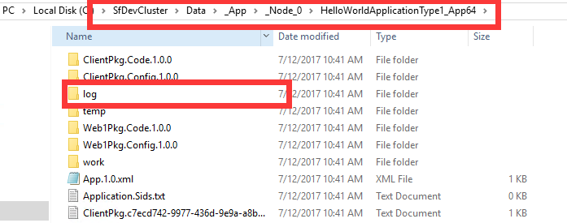
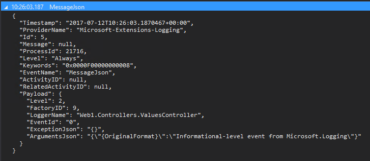

# 如何查看和收集 Service Fabric 中 ASP.NET Core 应用产生的日志

## 问题描述

在 Service Fabric 中，我们在开发 ASP.NET Core 服务时，会使用到 Microsoft.Extensions.Logging 生成应用服务日志，但很多用户不清楚如何查看这些日志，以及如何使用 Azure Diagnostics 导出这些数据。

## 解决方案

ASP.NET Core 中内置了很多 Log Providers，如下图， 我们可以选择 Console，DEBUG 或者 Event Source 作为我们的 Log Providers，这样我可以将日志输出或者以 Event Tracing of Windows（window 追踪事件）的形式记录下来。

在使用这些 Log Provider 之前，我们将相关引用包加入到项目中。

之后在初始化 LogFactory 时，选择使用 Log Provider，参考以下代码：

如果使用 Console，DEBUG，我们需要在服务的配置文件中（ServiceManifest.xml），将程序的 output 输出到文件中，如下配置：

该日志存储于以下目录（本地开发环境，Azure 上时 D 盘）：

使用 Event Source 会将 Logging 以 Event Source 的使用的方式（ETW）将日记记录下来。之后我们可以像使用 Event Source 一样，将其收集到存储账号中。在收集日志时需要配置 Provider Name 为 “Microsoft-Extensions-Logging”。

## 参考文档

- [内置日志提供程序](https://docs.microsoft.com/en-us/aspnet/core/fundamentals/logging#built-in-logging-providers)

- [更新诊断以从新的 EventSource 通道收集并上传日志](https://docs.azure.cn/zh-cn/service-fabric/service-fabric-diagnostics-how-to-setup-wad#update-diagnostics-to-collect-and-upload-logs-from-new-eventsource-channels)