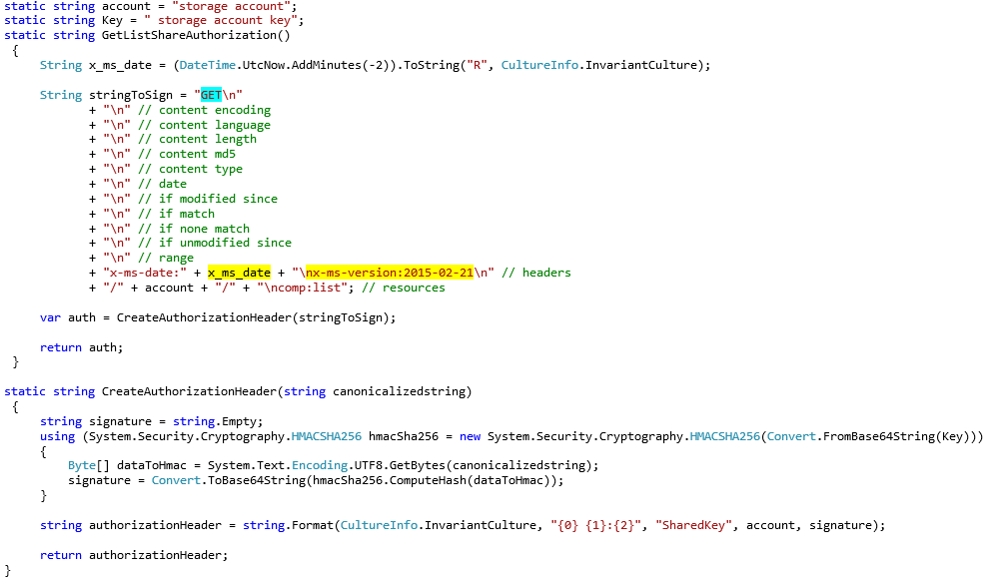
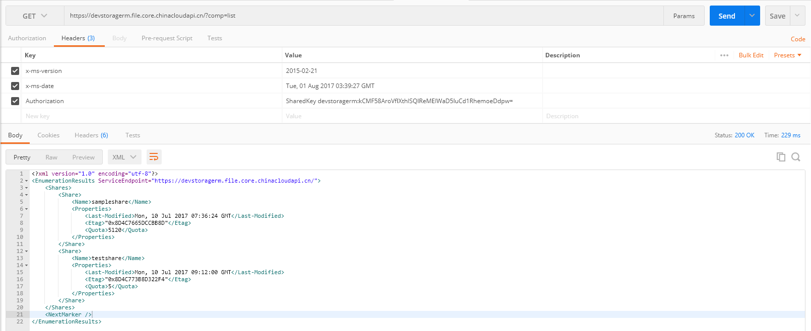
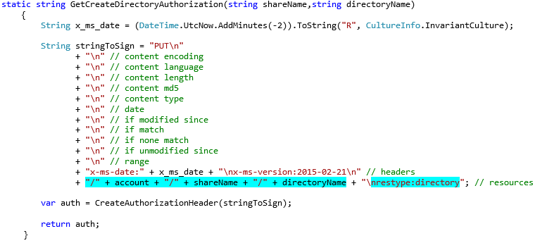
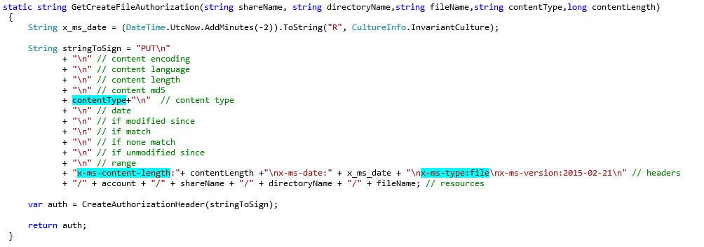

# 存储 REST 接口调用使用说明及范例

目前，Azure 几乎提供了各种主流语言的 SDK，以适应不同技术需求的客户。我们知道这些 SDK 都是基于 Azure Rest Sevice 实现的封装，以方便用户使用而无需关系协议传输细节。

不过，在技术支持过程中，发现仍然有很多用户需要在特定的场合下，通过调用 Azure REST 接口来实现某部分业务的需求。Azure 官方文档针对 REST 提供的解释略有欠缺、英文资料较多，范例较少，这增加了我们直接使用 REST 接口的难度。

由于每一类 Azure 服务都暴露了一定的 REST 接口，涵盖甚光，因此我们不会通篇介绍所有 REST 接口的使用，本文将主要针对近期技术过程中存储 REST 服务接口做相关的说明并提供一些范例。

1. [Azure Storage Services REST API Reference](https://docs.microsoft.com/zh-cn/rest/api/storageservices/azure-storage-services-rest-api-reference)

    这个文档中涵盖了所有 Storage 公开的 REST 接口，使用接口的主要难点是如何填充请求参数，因为某些参数的设置规则依赖于复杂的算法或字符格式，如果不能很好的理解官方的解释，往往会产生各种各样的错误。

2.	我们分析下该示例 : [List Shares](https://docs.microsoft.com/en-us/rest/api/storageservices/list-shares)
    
    1. 这是一个 GET 方法的请求，在发起这个请求时，必须提供以下 3 个参数：

        

    2. 关于后两个参数的设置比较简单，一个是设置请求的时间，另一个是设置请求服务的版本，那么关于第一个参数值的设置就比较复杂了，可以参考：[Azure 存储服务的身份验证](https://docs.microsoft.com/en-us/rest/api/storageservices/authentication-for-the-azure-storage-services)。也许您看完这篇文档后，还是很难理解 Authorization 的构建。简单来说，可以分两步操作：

        1. 基于调用请求的方法类型、参数内容来构建 “**签名字符串**”:

            

        2. 对签名字符串执行以下算法：

            ```
            Signature=Base64(HMAC-SHA256(UTF8(StringToSign)))
            Authorization = SharedKey <storage account>:<Signature>       
            ```

接下来，我们通过 File Storage REST 的几个示例，来向大家呈现使用过程。以下示例中使用了 C# 编程语言、Chrome Postman，因此需要具备此类相关知识。

1. 调用 [ListShare](https://docs.microsoft.com/ch-cn/rest/api/storageservices/list-shares) 接口

    - Request: 

        ```
        https://<storage name>.file.core.chinacloudapi.cn/?comp=list
        ```

    - Request Headers:

        - x-ms-version：         
            必须。 指定存储服务的版本（UTC），这个版本会影响 Authorization 的生成，建议使用 2015-02-21
        - x-ms-date：              
            必须。 指定请求的协调世界时（UTC）
        - Authorization:        
            必须。指定请求的客户端认证，这个值的生成是比较复杂的，需要基于不同的请求类型来构建签名字符串，然后使用 HMAC-SHA256 算法在 UTF-8 编码该字符串。

    - Authorization（C#）:
        
        

    - Postman Test:

        
        
        > [!NOTE]
        > 请求的 x-ms-date 和 x-ms-version 也要与代码中设定的值同步

2. 调用 [Create Share](https://docs.microsoft.com/zh-cn/rest/api/storageservices/create-share) 接口

    - Request: 

        ```
        https://<storage name>.file.core.chinacloudapi.cn/<share name>?restype=share 
        ```

    - Request Headers:

        - x-ms-version：         
        必须。 指定存储服务的版本（UTC），这个版本会影响 Authorization 的生成，建议使用 2015-02-21
        - x-ms-date：              
        必须。 指定请求的协调世界时（UTC）
        - Authorization           
        必须。指定请求的客户端认证，这个值的生成是比较复杂的，需要基于不同的请求类型来构建签名字符串，然后使用 HMAC-SHA256 算法在 UTF-8 编码该字符串。

    - Authorization（C#）：
    
        与 ListShare 签名字符串是有差异的，Method 要根据 REST 请求类型进行更改，另外要结 REST 所需的 Header 适当修改 "headers" 的配置，同时在本示例中，"resources" 部分是调整比较大的参考以下签名内容：

        
    
    - Postman Test：

        

        

3. 调用 [Create Directory](https://docs.microsoft.com/en-us/rest/api/storageservices/create-directory) 接口

    - Request: 

        ```
        https://<storage name>.file.core.chinacloudapi.cn/<share name>/<directory name>?restype=directory
        ```

    - Request Headers:

        - x-ms-version：         
        必须。 指定存储服务的版本（UTC），这个版本会影响 Authorization 的生成，建议使用 2015-02-21
        - x-ms-date：              
        必须。 指定请求的协调世界时（UTC）
        - Authorization           
        必须。指定请求的客户端认证，这个值的生成是比较复杂的，需要基于不同的请求类型来构建签名字符串，然后使用 HMAC-SHA256 算法在 UTF-8 编码该字符串。

    - Authorization（C#）：
        
        与 Create Share 不同的是 resources，这里的 resource 要包括目录这一层，同时 restype 为 directory：

        

    - Postman Test：

        

        

4.	调用 [Create File](https://docs.microsoft.com/en-us/rest/api/storageservices/create-file) 接口

    - Request: 

        ```
        https://<storage name>.file.core.chinacloudapi.cn/<share name>/<directory name>/<file name>
        ```

    - Request Headers:

        - x-ms-version：                         
        必须。 指定存储服务的版本（UTC），这个版本会影响 Authorization 的生成，建议使用 2015-02-21
        - x-ms-date：                              
        必须。 指定请求的协调世界时（UTC）
        - x-ms-content-length:             
        必须。设置文件的最大大小
        - x-ms-type:                                  
        必须。设置为 file
        - Authorization                           
        必须。指定请求的客户端认证，这个值的生成是比较复杂的，需要基于不同的请求类型来构建签名字符串，然后使用 HMAC-SHA256 算法在 UTF-8 编码该字符串。

    - Authorization（C#）：

        contentType 是一个可选项，如果不设置，就用 \n 代替。“headers”的设置增加了 x-ms-content-length 和 x-ms-type，而且要有顺序保证（与服务器端签名对齐），“resources”的设置因为参数中已经不包含 restype，所以不需要设置：

        

    - Postman Test：

        

        

以上介绍了调用 File REST 的示例，整体来说使用 REST 难度要略大一些，最麻烦的是要考虑“签名字符串的规则”，因为每个请求都不一样，要逐个分析。以下是一些技巧：

1.	先查看 Request 的 Method，是 Get、Put、还是 Post 或其它类型。
2.	查看请求中是否包含 URI 参数，如果包含，比如示例 2 中的 restype，这样在构建签名字符串中要设置到 “resources” 中。
3.	查看所有 Required Header，只要是 Required 就必须设置，在构建签名字符串中要设置到“headers”中。
4.	另外，“resources” 要合理根据 path 来设定，比如的 share 中存在递归目录，如 share/dir1/dir2/dir3，这样也要将相应的 path 格式设置到 Request 和 “resources” 中。
5.	同时，最重要的一点，即便我们设置好了签名字符串，也未必保障准确，有可能是一个空格符或者顺序问题，都会导致验证失败，这里的一种调试方法，是借助 postman 和 notepad++ compare 插件。

    - postman 可以测试验证请求能否提交成功，如果报错就会提示服务器端验证的签名字符串内容。
    - 然后利用 notepad++ compare 比 server 的签名字符串和我们上述代码中 stringToSign 的值，看看差在什么地方。

        

如果您希望对某类 REST 接口提供更多的介绍，请关注我的 [GitHub](https://github.com/hello-azure) 或联系技术支持团队热线：400-089-0365。