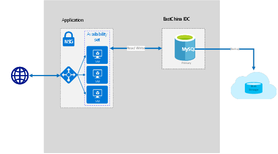
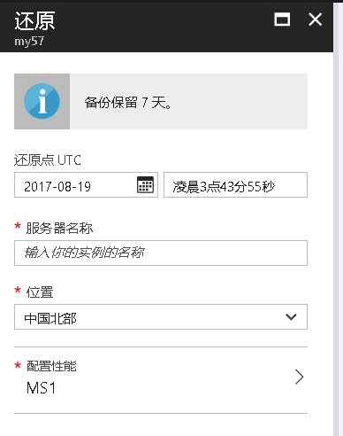
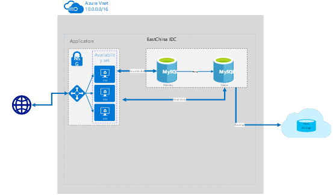
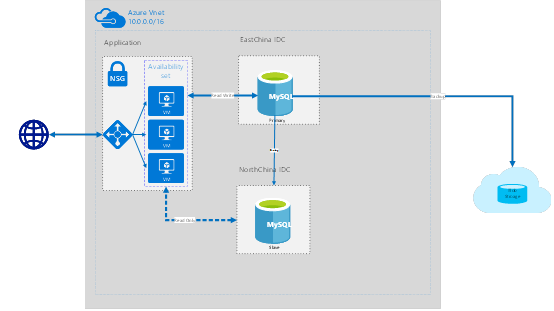
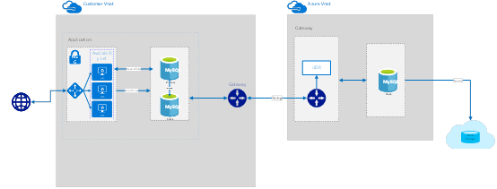

# MySQL Database on Azure 的高可用文档

很多用户会关心，如果选用了 Azure 上的 MySQL PaaS 服务，应该使用怎样的架构来服务我应用的可用性需求？

当需求得到了保障，我又要为这些设计支出多少费用呢？

以下为相关可用选配的性能及费用：

> [!NOTE]
> 相关价格基于 MySQL on Azure MS5 级别。

<table>
	<tr>
        <th></th>
	    <th>Geo Restore</th>
	    <th>Replication</th>
	    <th>Geo Replication</th>
	    <th>Geo Replication + Replication</th>
	    <th>On Prem Primary+Azure PaaS Slave</th>
	</tr>
	<tr>
        <th></th>
	    <th>异地还原</th>
	    <th>同数据中心可读复制</th>
	    <th>异地可读复制</th>
	    <th>同城可读复制 + 异地可读复制</th>
	    <th>基于用户 IDC 的 Azure 云复制节点</th>
	</tr>
	<tr>
	    <td>Instances</td>
	    <td>1</td>
	    <td>2</td>
	    <td>2</td>
	    <td>3</td>
	    <td>3</td>
	</tr>
	<tr>
	    <td>RPO</td>
	    <td>1 hour</td>
	    <td><10 secs</td>
	    <td>10 secs</td>
	    <td><10 secs</td>
	    <td>??(受限于网络)</td>
	</tr>
	<tr>
	    <td>ERT </td>
	    <td>3 hours</td>
	    <td><30 secs</td>
	    <td>30 secs</td>
	    <td><30 secs</td>
	    <td>??(受限于网络)</td>
	</tr>
	<tr>
	    <td>Cost</td>
	    <td>1608</td>
	    <td>3216</td>
	    <td>3216</td>
	    <td>4824</td>
	    <td>1608+???</td>
	</tr>
</table>

（服务级别可参考 : [如何确定工作负荷所需的 MySQL Database on Azure 服务层](https://docs.azure.cn/zh-cn/mysql/mysql-database-service-tiers)）

> [!NOTE]
> **Instances**: 代表需要的 MySQL 实例数量.(一个逻辑服务器)  
> **RPO**: 在发生中断性事件后，应用程序在完全恢复时可以丢失的最大最近更新数量（时间间隔）。RPO 用于度量故障期间的最大数据丢失。  
>**ERT**: 在发出还原或故障转移请求后，数据库完全可用之前预计持续的时间。

## 高可用架构的详细说明

### Geo Restore（异地还原）

Geo Restore 是 MySQL on Azure 的一项免费功能，提供 7 天的任意时间点还原及长达 30 天的备份点还原。

> [!NOTE]
> MP 级别可以将任意时间点还原及备份点还原全部延长到 35 天。

Azure 会将数据库的备份全部写入网络端的 Azure Blob Storage 中，Azure Blob Storage 基于加密的分布式协议设计，负责在多层面保障用户数据备份的可用性及安全性。

备份过程对用户完全透明，无需担心在备份的过程中要安排任何人手监控。

在故障发生或用户需要创建一个历史数据查询库时，可以通过在 Portal 上还原的方式，创建一个异地的数据库或任意时间的历史数据（可以用来还原用户因误操作而删除的生产数据）。

Geo Restore 为 MySQL on Azure 的标准功能之一，无需另外付费，即可让用户体验到单实例配合多地备份容灾的高可用架构。

> [!NOTE]
> 后续的其他的架构中全部包含 GeoRestore 功能设计，就不再额外进行介绍。  
> Geo Restore 因为有网络存储及分布式数据同步的限制，RPO 为 1 小时, ERT 为 3 小时。数据量越大则越有可能靠近该指标。

### Replication（同数据中心可读复制）

Replication 基于 Azure 的日志文件同步技术以实现事务日志的高效传输，从而使 Slave (从) 数据库节点与 Primary (主) 数据库节点有着近乎实时的同步速度，同时比起 MySQL 原生的复制技术更加安全高效。

Replication 又被称之为可读复制，基于可读复制的高可用架构，读节点可以使用不同的服务级别，在数据安全性上提供冗余支持，同时由于同机房复制相对于异地复制的网络延迟更低，使得 Slave 节点与 Primary 的延迟很低。

Replication 架构主要提供数据安全冗余以及对时效性要求较高的报表查询功能。

### Geo Replication（异地可读复制）

Geo Replication 在 Replication 技术的基础上提供了异地复制的功能，在创建将 Slave 节点定位于不同的地理位置（Location）中，从而实现异地两中心的冗余架构。

Geo Replication 相比较于 Geo Rstore 功能而言，提供了更短的 RPO 及 ERT，同时还可以用于对实时性要求不高的报表需求。

> [!NOTE]
> Geo Replication 的 ERT<30 秒, RPO <10 秒。

### Geo Replication +Replication（同城可读复制+异地可读复制）

双 Replication 的设计主要是为了满足部分企业对于两地三中心的容灾设计需求。在提供了最短灾难恢复时间的同时又可以分担对报表业务需求的压力。

### On Prem Primary+Azure MySQL PaaS Slave(基于用户 IDC 的 Azure 云复制节点)

由于 MySQL PaaS on Azure 属于集成式服务，所以获得全方位服务的同时，自己掌控的范围也变的相对较小，如果某些对于数据库服务器想有更多控制权限的用户来说，还可能会使用 Azure VM 自主搭建 MySQL DB，但在自主管理 MySQL 的同时，还想利用 Azure 管理的 PaaS 服务来提供容灾服务。

同时对于已经在生产环境中部署了 MySQL 的用户还可以使用基于 Gateway（VPN）建立的用户 ICD 与 Azure 云数据中心的复制通道，实现同城（异地）双机房的容灾能力。

相对于扩展 IDC 网络的繁琐，或者是自主搭建主从结构，实施备份计划，本对于实现数据上云，只需几步即可轻松实现。

[如何配置数据同步复制到 MySQL Database on](Azurehttps://docs.azure.cn/zh-cn/mysql/mysql-database-data-replication)

## 高可用模式相关问题

Azure 的数据备份目前不支持拷贝到本地，如果有读取备份中的数据，建议将备份恢复到另一台 MS1 的节点上进行读取，MS1 服务层级当前只需要 9 分钱/小时.

对于 MySQL Slave 的延迟，通常无需担心数据的安全性，至于为何会在数据同步中产生延迟可以参考下面一篇链接，同时在 MySQL 当前版本中，由于 Salve 的 SQL 进程需要单条应用，导致在并发量大时，日志应用会出现一段时间的无法跟上情况，此时可以考虑提升服务等级。

[主从复制问题](https://docs.azure.cn/zh-cn/mysql/mysql-database-readreplicainquiry)

## 附录

不同服务级别的收费价格(￥/month)：

| 级别 | MS1 | MS2 | MS3 | MS4  | MS5  | MS6  | MP1  | MP2  |
| ---- | --- | --- | --- | ---- | ---- | ---- | ---- | ---- |
| 价格 | 66  | 133 | 360 | 1074 | 1608 | 2413 | 2842 | 4471 |

