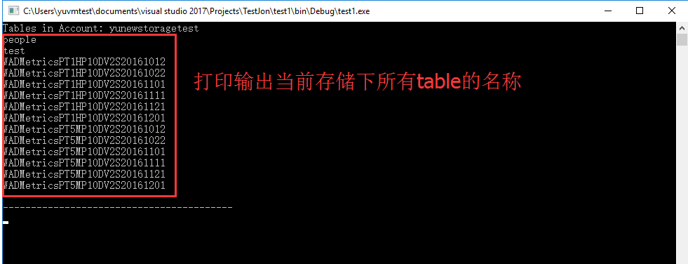

# Storage Table Rest API 调用示例

在使用参考直接基于 Rest API 操作 Azure Storage Table 的过程中，官方提供了两种方式进行认证，分别为：SharedKey 和 ShareKeyLite。在请求 Header 过程中加入 Date（或 x-ms-date）和 Authorization 参数即可完成认证。

## 调用示例

- 添加认证信息格式：

    ```
    x-ms-date: date_and_time
    Authorization: scheme_name account_name:signature
    ```

    从 Authorization 信息来看，`scheme_name` 参数对应 SharedKey 或 ShareKeyLite，`account_name` 对应存储的账户名称，都很容易获取，难点主要在 signature 参数的获取。下面分别基于 C# 给出构建两种认证方式的字符串：

- Sharedkey 签名字符串：

    ```C#
    string stringToSign = string.Format("{0}\n{1}\n{2}\n{3}\n/{4}/{5}",
        request.Method,
        request.Headers["Content-MD5"],
        request.Headers["Content-Type"],
        request.Headers["x-ms-date"],
        account,
        resource);
    ```

- SharedkeyList 签名字符串：

    ```C#
    string stringToSign = string.Format("{0}\n/{1}/{2}",
        request.Headers["x-ms-date"],
        account,
        resource);
    ```

- 认证 Authorization 获取：

    ```C#
    var sharedKey = Convert.FromBase64("the_sharedkey_from_the_azure_web");
    
    var hasher = new HMACSHA256(sharedKey);
    
    string signature = hasher.ComputeHash(Encoding.UTF8.GetBytes(strignToSign));
    string authorizationHeader = string.Format("SharedKey {0}:{1}",
        _account,
        Convert.ToBase64String(signature));
    ```

## 完整测试代码

```C#
using System;
using System.Globalization;
using System.IO;
using System.Net;
using System.Security.Cryptography;
using System.Text;
using System.Xml;

namespace test1
{
    class Program
    {
        static void Main(string[] args)
        {
            string Resource = "Tables";
            string _Account = "yunewstoragetest";//storage account
            string _Secret = "xzWNEIf4NhrDh1jie9CEdCkGNXfKVqdnGlJ3BlB7jcoj1w829L4F/t3+oh/qPLq1jvygUdR/HTIvqjRiz9GNkA==";//key

            //Create the web request
            string url = "https://yunewstoragetest.table.core.chinacloudapi.cn/" + Resource;
            HttpWebRequest request = (HttpWebRequest)HttpWebRequest.Create(url);
            request.ContentLength = 0;
            request.Method = "GET";

            //Add a date header to the request
            request.Headers.Add("x-ms-date", DateTime.UtcNow.ToString("R", CultureInfo.InvariantCulture));

            // Sign the request
            string signature = "GET\n";
            signature += "\n";
            signature += "\n";
            signature += request.Headers["x-ms-date"] + "\n";
            int q = Resource.IndexOf("?");
            if (q > 0) Resource = Resource.Substring(0, q);
            signature += "/" + _Account + "/" + Resource;

            // Hash-based Message Authentication Code (HMAC) using SHA256 hash
            HMACSHA256 hasher = new HMACSHA256(Convert.FromBase64String(_Secret));
            string authH = "SharedKey " + _Account + ":" + Convert.ToBase64String(hasher.ComputeHash(Encoding.UTF8.GetBytes(signature)));
            //// Authorization header
            request.Headers.Add("Authorization", authH);

            // Processing the results
            using (HttpWebResponse response = (HttpWebResponse)request.GetResponse())
            {
                using (StreamReader r = new StreamReader(response.GetResponseStream()))
                {
                    string xml = r.ReadToEnd();

                    int ret = (int)response.StatusCode;
                    if (ret == 200)
                    {
                        XmlDocument doc = new XmlDocument();
                        doc.LoadXml(xml);
                        XmlNodeList nodes = doc.GetElementsByTagName("d:TableName");
                        Console.WriteLine("Tables in Account: " + _Account);
                        foreach (XmlNode n in nodes)
                        {
                            Console.WriteLine(n.InnerText);
                        }
                    }
                    else
                    {
                        Console.WriteLine(xml);
                    }

                    Console.WriteLine();
                }
            }
            Console.WriteLine("-----------------------------------------");
            Console.ReadKey(true);
        }
    }
}
```

## 测试结果



## 参考链接

- [通过 REST 访问 Azure Tables](https://blogs.msdn.microsoft.com/rxg/2009/04/02/accessing-azure-tables-via-rest/)
- [Azure Storage Table 认证](http://blog.einbu.no/2009/08/authenticating-against-azure-table-storage/)
- [Azure Storage 服务的认证](https://docs.microsoft.com/en-us/rest/api/storageservices/authentication-for-the-azure-storage-services)
- [Azure Tables 操作](https://docs.microsoft.com/en-us/rest/api/storageservices/operations-on-tables)