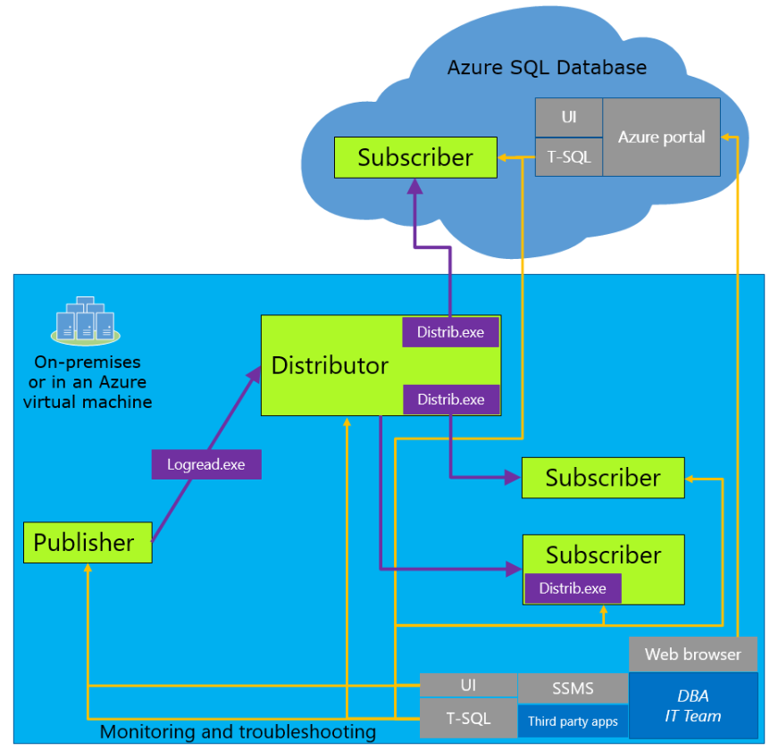
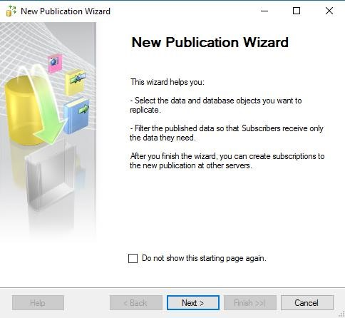
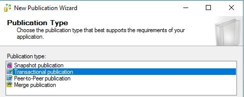
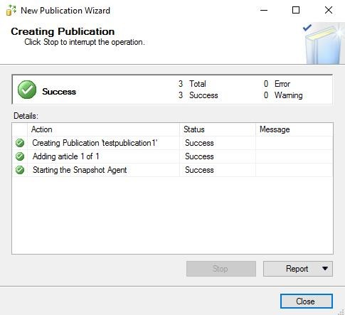
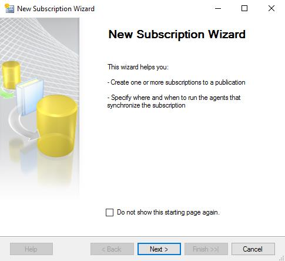
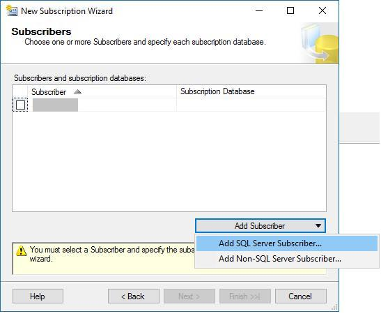
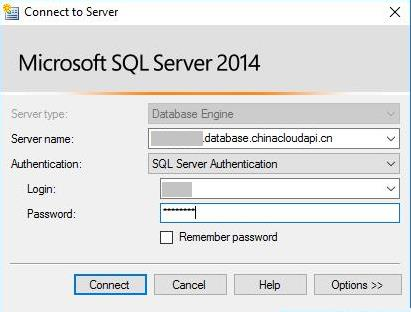
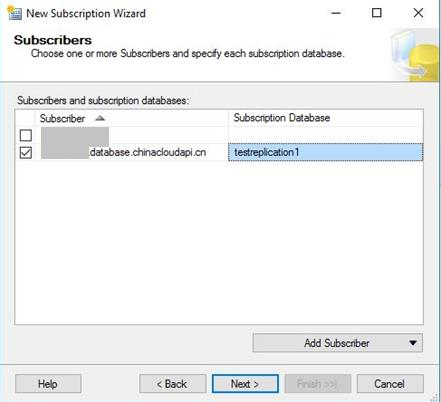
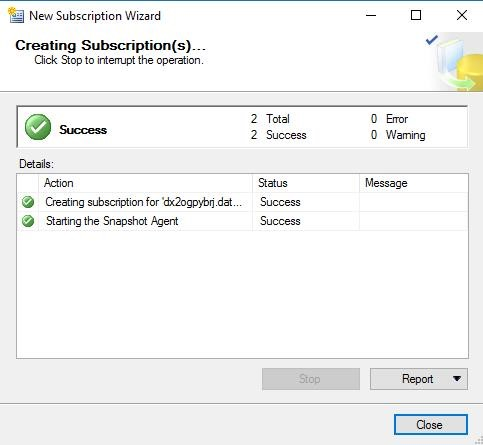
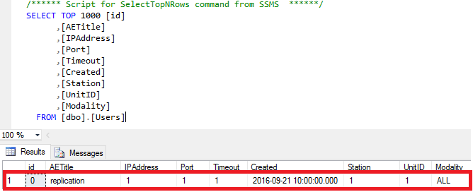

# 如何创建事务复制将本地数据同步到 SQL Azure #
Azure SQL DB 可以被配置成为 SQL Server 事务复制的一个订阅者( subscriber )。

主要应用场景有两种：

1.	将您的数据迁移到 Azure SQL DB, 并且没有宕机时间。
2.	将 Azure SQL DB 作为 SQL on-premises / on VMs 的一个备份或只读实例。

我们扩展了已有的事务复制逻辑以使得 Azure SQL DB 可以成为一个事务复制订阅者。
从使用的体验上来说，能够察觉到的唯一的区别是在你创建一个订阅者的时候：你需要提供 Azure SQL DB 的 URL 而非一台 server 或者一个实例的名字。如果您已经知道了怎么使用事务复制，那么在 Azure SQL DB 上面使用这个功能的学习成本几乎为 0，意味着您将有一种无缝的体验。将数据复制到 Azure SQL DB 上将会变得非常轻松和便捷。当发布服务器和分发服务器至少是以下 SQL Server 版本之一时，支持此方案：

- 	SQL Server 2016 CTP3（预览版）和更高版本 
-	SQL Server 2014 SP1 CU3 和更高版本
-	SQL Server 2014 RTM CU10 和更高版本
-	SQL Server 2012 SP2 CU8 和更高版本
-	SQL Server 2012 SP3（发行时）

它是如何工作的呢？  
数据的复制实际上是通过分发代理（ Distribution Agent ）完成的。  
下面的这张表展示了整体的架构：

注意事项：

1. 只支持 Snapshot 及单向的事务（ onpromise sql 到 sql azure ）复制. 不支持 Peer-to-peer transactional replication 及 merge replication。
2. 只提供 SQL Azure V12 的支持。
3. 无法通过 SQL Database 门户来配置事务复制。
4. 复制只能使用 SQL Server 身份验证方式登录连接到 SQL DB。
5. 只支持 push subscription。
6. 被复制的表必须要有主键。

下面的例子展示如何用 SQL Server Management Studio 将 Azure SQL DB 配置成为一个事务复制订阅者。

1. 创建一个新的事务复制。  
右键 Replication 下的 Local Publication，并选择 New Publication Wizard,会调出新建复制向导。  
    
2. 选择 Snapshot publication 或者 Transactional publication, 本示例以 Transactional publication 为例  
    
3. 完成向导中的后续步骤，创建一个复制。  
    
4. 创建一个新的订阅。  
   右键刚刚创建的发布，选择 New Subscriptions,调出新建订阅向导。  
    
5. 完成向导中所需步骤，在下图 Subscribers 页面，点击 Add Subscriber -> Add SQL Server Subscriber。  
    
6. 输入所需的信息，连接到 Azure SQL DB。  
    
7. 选择一个 Subscription Database 来接受复制内容。  
    
8. 完成向导的余下部分，创建订阅。  
    
9. 创建订阅后，可以看到改订阅出现在之前创建的发布下。  
    

在同步完成后，我们来验证一下复制是否生效。  
向 SQL Server 发布的这张表中插入数据后，等复制发生之后，发现插入的数据出现在了 Azure SQL DB 指定的表中。

